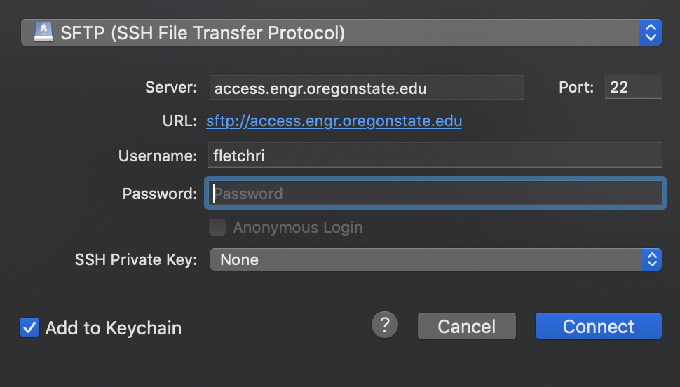

# OSU - CS161 Notes

Markdown notes and answers to chapter Q&A for Oregon State University's CS161 Summer 2019 course.

Notes on assigned readings from the following text(s):

- _Starting Out with C++: Early Objects, 10th Edition_ by Tony Gaddis, Judy Walters, and Godfrey Muganda.

*_Assignments will be posted after their due date. I’m available on [Slack](class-cs161-400-su19.slack.com) for help, if I can help, that is._  

## Recommended Tools 

- IDE: [VSCode](https://code.visualstudio.com/)
- Markdown Editor: 
  - Windows, MacOS, Linux: [Typora](https://www.typora.io/)
  - iOS: [Coda](https://panic.com/coda-ios/)
- Git:
  - Windows, MacOS, Linux: [Git](https://git-scm.com/book/en/v2/Getting-Started-Installing-Git)
  - iOS: [Working Copy](https://workingcopyapp.com/)
- FTP: 
  - Windows: [WinSCP](https://winscp.net/eng/index.php)
  - Mac: [Cyberduck](https://cyberduck.io/)
- Terminal:
  - Windows: [Git Bash](https://gitforwindows.org/), [Windows Terminal (Beta)](https://www.microsoft.com/en-us/p/windows-terminal-preview/9n0dx20hk701)
    - Ensure you have the[ Windows Subsystem for Linux (WSL)](https://docs.microsoft.com/en-us/windows/wsl/install-win10) installed
    - In your WSL, you’ll also need to install the `g++` compiler:
      `sudo apt-get install build-essential g++`
  - Mac: [iTerm2](https://www.iterm2.com/)
- Shell (ZSH): [Oh My ZSH](https://ohmyz.sh/)
  - Theme: [Powerlevel9k](https://github.com/bhilburn/powerlevel9k)

## Assignment Submission

There are two ways you can create, compile, and submit your assignment. SSH or an FTP client, both of which you should have set up.

### **SSH**:

1. SSH into `flip` via your Terminal
   1. `ssh <OSU_ID>@access.engr.oregonstate.edu`
   2. Enter password
2. Create a directory for your work & create your files
   1. `mkdir <weekX>`
   2. `touch <FILE_NAME>.cpp`
   3. `vim <FILE_NAME>.cpp` and begin writing your program.
      1. `i` to enter edit mode
      1. `ctrl + c` or `esc` to leave edit mode
      2. `:exit` or `:wq` to save and exit `vim`
3. Compile your `cpp` file
   
   * `g++ <FILE_NAME>.cpp -o <EXECUTABLE_NAME>`
4. Run your file
   1. `./<EXECUTABLE_NAME>`
   2. Ensure the program behaves as expected
5. Download the files from `flip` to your local machine:
   1. `scp <OSU_ID>@access.engr.oregonstate.edu <PATH_TO_YOUR_LOCAL_DIR>`
      * If you have permissions errors, prefix this command with `sudo` and enter your password (for your local machine)
      
      2. For example, if I wanted to download the files to my Documents directory:
         * `scp fletchri@access.engr.oregonstate.edu ~/Documents`
   2. Enter your OSU password
6. You may need to recompile your program. `cd` to the directory you downloaded your files to and recompile.
   
   * For example: `cd ~/Documents && g++ animal.cpp -o animal`
7. Upload your program to [Mimir](https://class.mimir.io/)

### **FTP**:

1. In your FTP client, open a connection to `sftp://access.engr.oregonstate.edu`. Ensure you’re using the **SFTP** protocol. Regular FTP will **not** work.

2. Enter your username and password, then **Connect**:

    

3. On your local machine, create your program and compile it:
   1. `cd /local/directory && touch myprogram.cpp`
   2. Open your file in your preferred IDE:
      * For **VSCode**, `code myprogram.cpp`
   3. Once finished, compile your program & run it:
      1. `g++ myprogram.cpp -o myprogram`
      2. `./myprogram`
   4. After you’ve tested your program and are ready to submit, use your FTP client to drag & drop the files to `flip`. (I’m not sure why we have to do this since we submit on Mimir)
   5. Upload your program to [Mimir](https://class.mimir.io/)

## Issues

If you have any issues or suggestions, either [email me](mailto:risa.fletcher@gmail.com) or file an issue.

