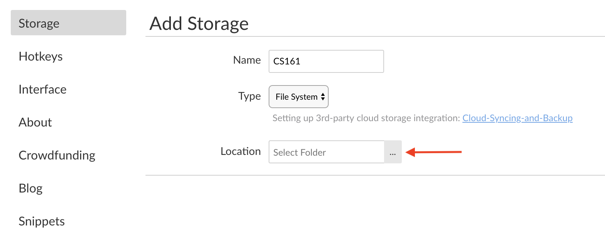

# OSU - CS161 Notes

Notes for Oregon State University's CS161 Summer 2019 course. Includes [**Boostnote**](https://boostnote.io/) files as well as regular markdown.

Raw Boostnote files are available in `/notes`. Markdown notes are available in `/notes/markdown` and markdown review q&a are available in `/review_qa`. I will update this readme as the scaffolding changes. 

Notes on assigned readings from the following text(s):
 - _Starting Out with C++: Early Objects, 10th Edition_ by Tony Gaddis, Judy Walters, and Godfrey Muganda.
 
 ## Linking to Boostnote
 
 To link this repo to **Boostnote**, clone or download this repo. Then, in Boostnote, go to **Preferences** > **Storage** > **Add Storage Location** and enter a **Name** (I used `CS161`) and in **Location**, select the cloned repo on your machine.

