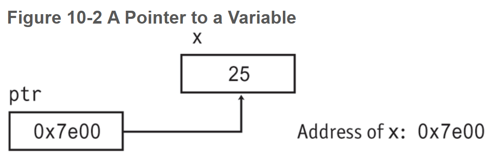
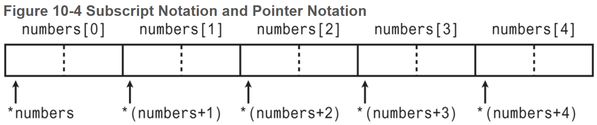
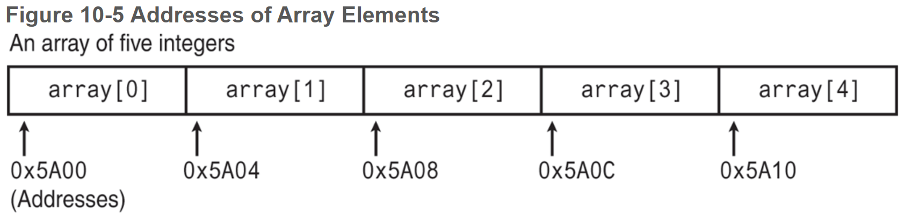
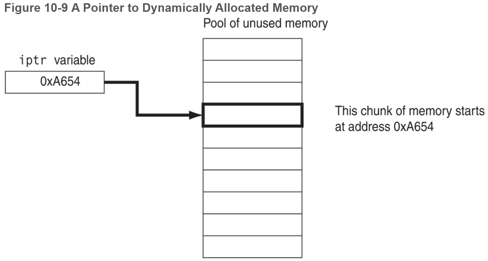
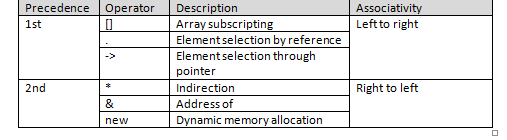

# Chapter 10: Pointers


------

## 10.1 Pointers and the Address Operator

`&` - The address operator

- Be careful not to confuse the use of '&' for passing by reference with its use as the "address of" operator.  They are two separate things.  When you see it on the right hand of an assignment, or as an argument in a function call, it means "address of".  When you see it in the parameter list of a function, it means that you're passing by reference.

**pointer** - the address of a memory location.

Each byte of memory has a unique address. A variable’s address is the address of the first byte allocated to that variable.

- Most compilers allocate space in such a way that individual variables are always assigned even addresses because hardware can access data that resides at even addresses faster than odd addresses.
- Addresses are printed in hexadecimal.


## 10.2 Pointer Variables

**pointer variable** - a variable that stores an address.

```c++
// the asterisk below is used to define a pointer variable
int *ptr;	// The variable ptr points to has type int

// can also be written as:
int* ptr;
/*********************************/
int x = 25;		// int variable
int *ptr;		// pointer variable, can point to an int
ptr = &x;		// store the address of x in ptr

*ptr = 100;		// use indirection operator to modify the value of x
cout << x << endl;	// 100
```

The asterisk before the variable indicates `ptr` is a pointer variable and the `int` data type indicates that `ptr` can only be used to point to, or hold addresses of, integer variables.

**indirection operator (*) ** - allows you to pass from a pointer to a variable being pointed to. It _dereferences_ the pointer.




## 10.3 The Relationship Between Arrays and Pointers

The name of an array is actually the starting address of the array. Array names are **pointer constants** because you can’t make them point to anything but the array they represent.

When you add a value to a pointer, you are actually adding that value _times the size of the data type being referenced by the pointer.

```c++
array[index] is equivalent to *(array + index)
```



```c++
// This program uses subscript notation with a pointer
// variable and pointer notation with an array name.
#include <iostream>
#include <iomanip>
using namespace std;

int main()
{
   const int NUM_COINS = 5;
   double coins[NUM_COINS] = {0.05, 0.1, 0.25, 0.5, 1.0};
   double *doublePtr; // Pointer to a double

   // Assign the address of the coins array to doublePtr
   doublePtr = coins;
   
   // Display the contents of the coins array
   // Use subscripts with the pointer!
   cout ≪ setprecision(2);
   cout ≪ "Here are the values in the coins array:\n";
   for (int count = 0; count < NUM_COINS; count++)
      cout ≪ doublePtr[count] ≪ " ";
   
   // Display the contents of the coins array again, but
   // this time use pointer notation with the array name! 
   cout ≪ "\nAnd here they are again:\n";
   for (int count = 0; count < NUM_COINS; count++)
      cout ≪ *(coins + count) ≪ " ";
   cout ≪ endl;
   return 0;
}

// OUTPUT
Here are the values in the coins array:
0.05 0.1 0.25 0.5 1
And here they are again:
0.05 0.1 0.25 0.5 1
```


## 10.4 Pointer Arithmetic

- The `++` and `--` operators may be used to increment and decrement a pointer variable.

- An integer may be added or subtracted from a pointer variable. This may be performed with the `+`

 and `-` operators, or the `+=` and `-=` operators.

- a pointer may be subtracted from another pointer.


## 10.5 Initializing Pointers

When a pointer is initialized with an address, it must be the address of an object the pointer can point to.

```c++
int myValue;
int *pint = &myValue;	// data type matches object we're pointing to
```

Pointers may be defined in the same statement as other variables of the same type.

```c++
int myValue, *pint = &myValue;
int readings[50], *marker = readings;
```

- A pointer can only be initialized with the address of an object that has already been defined.

- A pointer variable that has not been initialized does not hold a valid address and an attempt to use such a pointer will result in execution-time errors. The convention in older versions of C++ is to assign the address 0 to a pointer that does not currently point to a valid memory location.

  - In many computers, the address 0 is occupied by operating system data and is not accessible to user programs, making this a safe choice f or a value that indicates an invalid memory location.
- Many header files, including `iostream`, `fstream`, and `cstdlib`, define a constant named `NULL` to represent the *pointer value* 0.
  - A pointer whose value is 0 is called a **_null pointer_**.
  - C++ 11 defines the key word `nullptr` to indicate an invalid memory address.
  
  

In C++ 11, putting an empty pair of braces `{ }` at the end of a variable definition initializes the variable to its default value. The default for numeric types such as `int`, `long`, and `double` is a zero, while the default for pointer types is `nullptr`.

```c++
int myInt = 0;
double myDouble = 0.0;
int *ptrToInt = nullptr;
// is equivalent to:
int myInt{ };
double myDouble{ };
int *ptrToInt{ };
```

- Pointers should always be initialized or assigned a value close to where they are defined.
- A pointer that is no longer pointing to a valid location should be assigned a value of `nullptr` unless the pointer is going out of scope or the program is about to terminate.


## 10.6 Comparing Pointers

Pointers may be compared using any of C++‘s relational operators. If one address comes before another address in memory, the first address is considered “less then” the second. In an array, all the elements are stored in consecutive memory locations, so the address of element 1 is _greater than_ the address of element 0.




Because addresses grow larger for each subsequent element in an array, the following Boolean expressions are true:

```c++
&array[1] > &array[0]
array < &array[4]
array == &array[0]
&array[2] != &array[3]
```

- Comparing two pointers is not the same as comparing the values the pointers point to.


## 10.7 Pointers as Function Parameters

An alternative to passing an argument by reference is to use a pointer variable as the parameter.

- In C, the only way to get the effect of pass by reference is to use a pointer.

```c++
void doubleValue(int *val)	// dereferencing val to being work on the variabled
{							// pointed to by val
*val *= 2;
}

doubleValue(&number);		// address must be used as an argument
```


## 10.8 Pointers to Constants and Constant Pointers

A pointer to a constant may not be used to change the value it points to; a constant pointer may not be changed after it has been initialized.

- A pointer to a constant must be declared as a `const` pointer parameter.

- A non-constant argument may also be passed to a pointer to a constant.

- A pointer to `const` points to a constant item. The data that the pointer points to cannot change, but the pointer itself can change.

- With a `const` pointer, it is the pointer itself that is constant. Once a pointer is initialized with an address, it cannot point to anything else.

  - The data a `const` pointer can be changed, so long as the data is not also a `const`.

  ```c++
  // example of a const pointer
  int value = 22;
  int * const ptr = &value;
  ```

  

## 10.9 Dynamic Memory Allocation

Variables may be created and destroyed while a program is running. To dynamically allocate memory means that a program, while running, asks the computer to set aside a chunk of unused memory large enough to hold a variable of a specific data type. Dynamic memory allocation is only possible through the use of pointers.

- The way a C++ program request dynamically allocated memory is through the `new` operator.

- `&` is the address operator. It is used to pass the address of a variable to a function.
- `*` is the indirection operator, also known as the dereferencing operator. It refers to the object to which its operand (that is, a pointer) points.



- Every call to `new` allocates storage from a special area of the program’s memory called the **heap**.

- `delete` is an operator that deallocates / frees memory to return to the heap, making the memory available for future use. 

- After `delete` has completed, the value of the pointer should be set to `nullptr` to indicate that it is no longer valid. The only exception to this rule is in situations (such as at the end of the program) where it is clear that the deleted pointer will never be used again.

  ```c++
  delete [] iptr;		// [] indicates a dynamically allocated array
  iptr = nullptr;
  ```


#### Dangling Pointers and Memory Leaks

A pointer is said to be _dangling_ if it is pointing to a memory location that has been freed by the call to `delete`. When you access a dangling pointer, you are trying to use memory that has already been freed and returned to the heap. n fact, such memory may already be reallocated by another call to `new`. You can avoid the use of dangling pointers by always

1. setting pointers to null as soon as their memory is freed, and
2. verifying that a pointer is not null before you attempt to access its memory.

A **_memory leak_** is said to occur if your program has finished using a block of memory allocated by `new` and you forget to free it via `delete`. The leaked block of memory remains unavailable until the program terminates.

- Only use pointers with `delete` that were previously used with `new`.
- The `new` operator returns the starting address of the memory allocated, and this address is assigned to the pointer variable.


## 10.10 Returning Pointers from Functions

Functions can return pointers, but you must be sure the item the pointer references still exists.

```c++
int *squares(int n)
{
   // Allocate an array of size n
   int *sqarray = new int[n];
   // Fill the array with squares
   for (int k = 0; k < n; k++)
   	sqarray[k] = (k+1) * (k+1);
   // Return base address of allocated array
   return sqarray;
}
```

A function can safely return a pointer to dynamically allocated storage that has not yet been deleted. In contrast, functions should not return pointers to local variables because the storage for such variables is automatically deallocated upon return.

- Whenever possible, the function that invokes `new` to allocate storage should also be the function that invokes `delete` to deallocate the storage.
- A class that needs to dynamically allocate storage should invoke `new` in its constructors and invoke the corresponding `delete` in its destructor. Because the destructor is automatically called by the system whenever an object is deleted or goes out of scope, a delete statement placed in a destructor will always be called.


## 10.11 Pointers to Class Objects and Structures

Pointers to dynamic memory allocation can be used with class objects and structures.

```c++
Rectangle *pRect = nullptr; // Pointer to Rectangle
Rectangle rect;             // Rectangle object
prect = &rect;				// assign address of rect to pRect
```

- The dot selector has higher priority than the `*` operator, so you’d access the `width` member by forcing the parentheses to force the indirection operator `*` to be applied first:

  ```c++
  (*pRect).width = 10;
  ```

- **structure pointer operator (->)** - also allows access to a member of a class object through a pointer.

  ```c++
  pRect->width = 10;
  pRect->calculateDimensions();
  ```

- The `new` operator is used to allocate class objects in the same way that it is used to allocate variables of other types. 

- 


## 10.12 Selecting Members of Objects

**Dereferencing Pointers to Structures**

| **Expression** | **Description**                                              |
| -------------- | ------------------------------------------------------------ |
| `s->m`         | `s` is a pointer to a structure variable or class object, and `m` is a member. This expression accesses the `m` member of the structure or class object pointed to by `s`. |
| `*a.p`         | `a` is a structure variable or class object and `p`, a pointer, is a member of `a`. This expression accesses the value pointed to by `a.p`. |
| `(*s).m`       | `s` is a pointer to a structure variable or class object, and `m` is a member. The * operator dereferences `s`, causing the expression to access the `m` member of the object *`s`. This expression is the same as `s`–>`m`. |
| `*s–>p`        | `s` is a pointer to a structure variable or class object and `p`, a pointer, is a member of the object pointed to by `s`. This expression accesses the value pointed to by `s–`>`p`. |
| `*(*s).p`      | `s` is a pointer to a structure variable or class object and `p`, a pointer, is a member of the object pointed to by `s`. This expression accesses the value pointed to by (*`s`).`p`. This expression is the same as *`s`–>`p`. |


