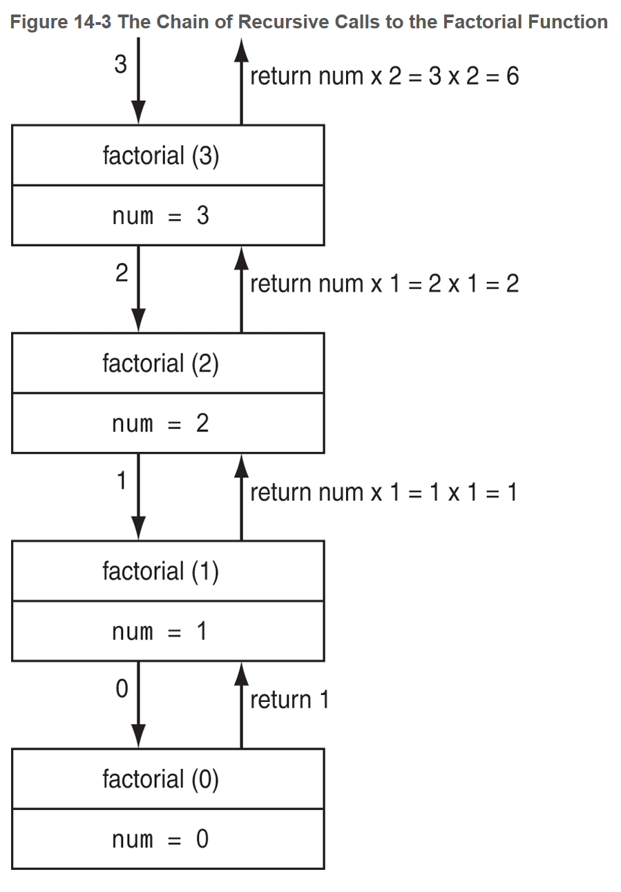

# Chapter 14: Recursion


## 14.1 Introduction to Recursion

A recursive function is one that calls itself. Each time the function is called, a new instance of its parameter is created in memory.

**depth of recursion** - the number of times a recursive function has been called.

**base case** - a subproblem that is simple enough to be solved directly. 

**direct recursion** - recursive functions that directly call themselves.

**indirect recursion** - a function that calls at least one other function that calls the first function.

**call frame** - when a function calls another function or itself, information about the current function is stored in the call frame, so that when we return to the function, we can pick back up where we left off.

**call stack** - where _call frames_ are stored.


## 14.2 The Recursive Factorial Function

The recursive factorial function accepts an argument and calculates its factorial. Its base case is when the argument is 0.

```C++
int factorial(int num)
{
    if (num == 0)	// base case
        return 1;
    else
        return num * factorial(num - 1);
}
```




## 14.3 The Recursive gcd Function

There is a recursive method for finding the greated common divisor (gcd) of two numbers.

```C++
gcd(x, y)	= y	// if y divides x with no remainder
    		= gcd(y, remainder of x/y) // otherwise
    
int gcd(int x, int y)
{
    if (x % y == 0)		// base case
        return y;
    else
        return gcd(y, x % y);
}
```


## 14.4 Solving Recursively Defined Problems

Some problems naturally lend themselves to recursive solutions, such as the Fibonacci sequence.

`0, 1, 1, 2, 3, 5, 8, 13, 21, 34, 55, 89, 144, 233, . . .`

The Fibonacci sequence can be defined as:

```
F0 = 0,
F1 = 1,
FN = FN − 1 + FN − 2     for all  N  ≥  2.
```

Example solution:

```C++
int calculateFibSeq(int counter, int current, int prev)
{
    if (counter == 1)	// base case
        return prev;
    
    return fib(counter - 1, current + prev, current);	// recursive case
}

int getFibSeq(int term)	// helper function
{
    return calculateFibSeq(term, 1, 1);
}

int main()
{
    std::cout << getFibSeq(10) << std::endl;
}
```

