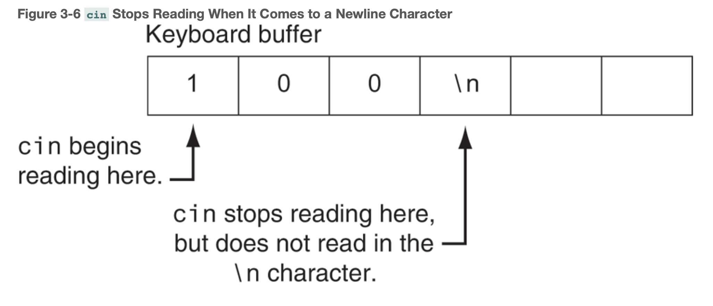
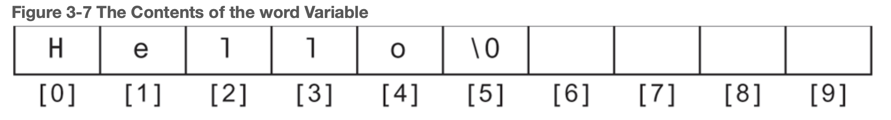

# Chapter 3: Expressions and Interactivity

## Table of Contents

- [3.1 The `cin` Object](#31-the--cin--object)
    + [Program Output with Example Input Shown in Bold](#program-output-with-example-input-shown-in-bold)
- [3.2 Mathematical Expressions](#32-mathematical-expressions)
  * [Precedence of Arithmetic Operators (Highest to Lowest)](#precedence-of-arithmetic-operators--highest-to-lowest-)
- [3.3 Data Type Conversion and Type Casting](#33-data-type-conversion-and-type-casting)
  * [Rules that govern evaluation of mathematical expressions](#rules-that-govern-evaluation-of-mathematical-expressions)
      - [**Rule 1**](#rule-1-char-short-and-unsigned-short-values-are-automatically-promoted-to-int-values)
      - [**Rule 2**](#rule-2-when-an-operator-works-with-two-values-of-different-data-types-the-lower-ranking-value-is-promoted-to-the-type-of-the-higher-ranking-value)
      - [**Rule 3**](#rule-3-when-the-final-value-of-an-expression-is-assigned-to-a-variable-it-will-be-converted-to-the-data-type-of-that-variable)
      - [C-style Cast](#c-style-cast)
      - [Pre-standard C++ Cast](#pre-standard-c---cast)
- [3.4 Overflow and Underflow](#34-overflow-and-underflow)
- [3.5 Named Constants](#35-named-constants)
- [3.6 Multiple and Combined Assignment](#36-multiple-and-combined-assignment)
  * [Combined Assignment Operators](#combined-assignment-operators)
- [3.7 Formatting Output](#37-formatting-output)
    + [Stream Manipulators](#stream-manipulators)
- [3.9 More Mathematical Library Functions](#39-more-mathematical-library-functions)
- [3.10 Random Numbers](#310-random-numbers)
      - [Limiting the Range of a Random Number](#limiting-the-range-of-a-random-number)
- [3.11 Focus on Debugging: _Hand Tracing a Program_](#311-focus-on-debugging---hand-tracing-a-program-)

------


## 3.1 The `cin` Object

`cin` (**c**onsole **in**) can be used to read data typed at the keyboard.

*_Remember to include the_ `iostream` _header file in any program that uses_ `cout` _or_ `cin`.

The `>>` symbol is the **_stream extraction operator_**, which _extracts_ characters from the input stream so they can be used in a program. More specifically, the stream extraction operator gets characters from the stream object on its left and stores them in the variable whose name appears on its right.  

The `cin` object causes a program to wait until data is typed at the keyboard and the [Enter] key is pressed. No other lines will be executed until `cin` gets its input.

When the user enters characters from the keyboard, they are temporarily placed in an area of memory called the **_input buffer_**, or **_keyboard buffer_**. When `cin` reads them, it automatically converts them into the data type of the variable where the input data will be stored. For example, if the user types `10`, it is read as the characters `'1'` and `'0'`, but `cin` is smart enough to know this will have to be converted to the `int` value `10` before it is stored in a variable.

If a user enters a floating-point number like `10.7`, there is a problem. `cin` knows such a value cannot be stored in an `int` value, so it stops reading when it gets to the decimal point, leaving the decimal point and the rest of the digits in the input buffer.

```
cout << "Enter the length and width of the rectangle ";
cout << "separated by a space. \n";
cin >> length >> width;
```


#### Program Output with Example Input Shown in Bold

```
Enter the length and width of the rectangle separated by a space.

10 20[Enter]

The area of the rectangle is 200
```

In the example output, the user entered `10` and `20` so `10` is stored in `length` and `20` is stored in `width`.

Notice the user separates the numbers by spaces as they are entered. This is how `cin` knows where each number begins and ends. It doesn't matter how many spaces are entered between the individual numbers.

```
cout << "Enter an integer, a double, and a character";
cin >> whole >> factional >> letter;
```


## 3.2 Mathematical Expressions

C++ allows you to construct complex mathematical expressions using multiple operators and grouping symbols.

When sending an expression that includes an operator to `cout`, it is always a good idea to put parentheses around the expression. Some operators will yield unexpected results otherwise.


### Precedence of Arithmetic Operators (Highest to Lowest)

| **Operator** | **Type** | **Description**                                    |
| ------------ | -------- | -------------------------------------------------- |
| `( )`        |          | Expressions within parentheses are evaluated first |
| `-`          | urnary   | Negation of a value, e.g., -6                      |
| `*  /  %`    | binary   | Multiplication, division, modulus                  |
| `+ -`        | binary   | Addition and subtraction                           |


**Associativity** is the order in which an operator works with its operands. Associativity is either _left to right_ or _right to left_.

| **Operator**          | **Associativity** |
| --------------------- | ----------------- |
| `(urnary negation) -` | Right to left     |
| `* /  %`              | Left to right     |
| `+  -`                | Left to right     |


C++ does not have an exponent operator. Raising a number to a power requires the use of a _library function_. A **library function** is a routine that performs a specific operation.

C++ uses the `pow` function for exponents. It accepts 2 arguments: a base and a power. `pow(base, exponent)`

`pow`:
- expects floating-point arguments (`double`)
- must include the `cmath` header file
- returns a `double` value

```
double area;
area = pow(4.0, 2);
```

***arguments** are information being sent to a function.


## 3.3 Data Type Conversion and Type Casting

When an operator's operands are of different data types, C++ automatically converts them to the same data type. When it does this it follows a set of rules, and understanding these rules will help you prevent subtle errors from creeping into your programs.

| **Data Type Ranking**    |
| ------------------------ |
| `long double`            |
| `double`                 |
| `float`                  |
| `unsigned long long int` |
| `long long int`          |
| `unsigned long int`      |
| `long int`               |
| `unsigned int`           |
| `int`                    |

*One exception to this ranking is when an `int` and a `long int` are the same size. In that case, an `unsigned int` outranks a `long int` because it can hold a higher value.


**type coercion**: the conversion of one type of object to a new object of a different type.

**promotion**: when a value is converted to a higher data type.

**demotion**: when a value is converted to a lower data type.


### Rules that govern evaluation of mathematical expressions

##### **Rule 1**: `char`, `short`, and `unsigned short` values are automatically promoted to `int` values.

*_The only exception to this rule is when an_  `unsigned short` _holds a value larger than can be held by an_ `int`.  _This can happen on systems where a_ `short` _is the same size as an_ `int`. _In this case, the_ `unsigned short` _is promoted to_ `unsigned int`.


##### **Rule 2**: When an operator works with two values of different data types, the lower-ranking value is promoted to the type of the higher-ranking value.

```C++
int years;
double interestRate;
years * interestRate;	// before multiplication, years will be promoted to a double
```


##### **Rule 3**: When the final value of an expression is assigned to a variable, it will be converted to the data type of that variable.

```C++
long int area;
int length,
	width;
area = length * width;	// the result will be promoted to long so it can be stored in area
```


**Type cast expression**: an expression that manually demotes or promotes a value (changes the data type). C++ provides several different types of cast expressions. `static_cast` is the most commonly used type cast expression.

```C++
// Value: variable or literal value you wish to convert
// DataType: the data type you wish to convert it to
static_cast<DataType>(Value)
    
// Example
double number = 3.7;
int val;
val = static_cast<int>(number);	// returns a copy of number, converted to an int
```

##### C-style Cast

```c
booksPerMonth = (double)books / months;
```

##### Pre-standard C++ Cast

```c++
booksPerMonth = double(books) / months;
```


## 3.4 Overflow and Underflow

When a value cannot fit in the number of bits provided by a variable’s data type, **overflow **or **underflow **occurs.


**High-order bit**: leftmost bit

A number with a `0` in the high-order bit is interpreted as a **positive number**. A number with a `1` in the high-order bit is interpreted as a **negative number**.


Examples of overflow:

- when a value exceeds the number of bits that data type allows.
- when an integer variable is holding the value at the far end of its data type’s negative range and 1 is subtracted from it, its higher-order bit will become a `0`, resulting in a positive number.

Examples of underflow:

- when a **floating-point value** is too close to zero and is so small that more digits of precision are needed to express it than can be stored in the variable holding it. 


## 3.5 Named Constants

Literals may be given names that symbolically represent them in a program.

- Constant names are typically all-caps: `const double INTEREST_RATE = 0.069;`
- Constants are read-only.


## 3.6 Multiple and Combined Assignment

Multiple assignment means to assign the same value to several variables with one statement.

```C++
a = b = c = d = 12	// a, b, c, and d are all assigned a value of 12
```


### Combined Assignment Operators

| **Operator** | **Example Usage** | **Equivalent To** |
| ------------ | ----------------- | ----------------- |
| `+=`         | `x += 5;`         | `x = x + 5`;      |
| `-=`         | `y -= 2;`         | `y = y - 2;`      |
| `*=`         | `z *= 10;`        | `z = z * 10;`     |
| `/=`         | `a /= b;`         | `a = a / b;`      |
| `%=`         | `c %= 3;`         | `c = c % 3;`      |


## 3.7 Formatting Output

`cout` provides ways to format data as it is being displayed. This affects the way data appears on the screen.


#### Stream Manipulators

`setw(minimum width = # of spaces)`: defines the minimum number of positions in the print field. Any value requiring a larger field than the specified minimum will cause `cout` to override the  `setw` value.


`setprecision(# of significant digits)`: specifies the number of significant digits to be displayed for a floating-point number. If the value is expressed in fewer digits, the manipulator will have no effect. By default, the system displays floating-point values with 6 significant digits.

```C++
cout << setprecision(5) << 307.00
// output
307.00
```


`fixed`: indicates that floating-point output should be printed in _fixed point_, or decimal notation. When used in conjunction with the `setprecision` manipulator, it specifies the number of digits to be displayed after the decimal point rather than the total number of digits displayed.

```C++
cout << fixed << setprecision(2) << 307.00
// output
307.00
```

`showpoint`: indicates that a decimal point and decimal digits should be printed for a floating-point number, even if the value being displayed has no decimal digits. 6 significant digits are displayed by default.

```C++
double x = 456.0;
cout << showpoint << x << endl;
// output
456.000
```

`left`: causes subsequent output to be left-justified.

`right`: causes subsequent output to be right-justified.


## 3.8 Working with Characters and Strings

Special functions exist for working with characters and strings. `char` can only hold one character, whereas a variable defined as a string can hold a whole set of characters.

#### Inputting a String

When `cin` reads data it passes over and ignores any leading _whitespace_ characters (spaces, tabs, or line breaks). However, once it comes to the first nonblank character and starts reading, it stops when it gets to the next whitespace character. To solve this problem, you can use the C++ function `getline`, which reads an entire line, including leading and embedded spaces, and stores it in a `string` object.

```c++
getline(cin, inputLine);
```

For example:

```c++
string name;
string cityState;

cout << "Please enter your name: ";
getline(cin, name);
cout << "Enter the city you live in: ";
getline(cin, cityState);
cout << name << " lives in " << cityState << end;

// John Doe lives in Spokane, WA
```

If you have a menu-driven program where the user should be able to simply “press Enter to continue”, `cin >>` will not work, because it does not pick up on whitespace characters. In this situation you can use `cin.get()`.

* is a _member function_ of `cin`
* reads a single character, including any whitespace character (no arg)

If the character needs to be stored in a variable:

```c++
cin.get(ch);
ch = cin.get();
```

When `cin >>` is used in conjunction with `cin.get`, some errors may arise when using `cin.get` after `cin >>`. When something is input using `cin >>`, the user types in a value and hits the [Enter] key. The [Enter] key causes a `‘\n’` character to be stored in the keyboard buffer right after the inputted value.



When `cin.get` executes, it begins reading the keyboard buffer from where the previous input operation stopped and it finds the newline character, so it uses that and does not wait for the user to input another value. This can be fixed with `cin.ignore`.

```
cin.ignore(numberofCharacters, characterToLookFor);		// arguments are optional
```

* causes `cin` to skip the next `numberOfCharacters` OR until `characterToLookFor` is encountered, whichever comes first
* if no arguments, `cin` will only skip the very next character
  * this is helpful in simple prompts that require [Enter] before proceeding
    `cin.ignore();`

#### Useful `string` Member Functions and Operators

* **`str.assign(num, char)`**: allows you to assign a set of repeated characters to a string without having to count the characters
* **`str.length()`**: returns an `int` length of the string
* **+** concatenates (joins) two strings together

#### Using C-Strings

**C-string**: a group of 1-byte memory cells (an array) that hold the characters of a string.

* as with string literals, a null-terminator `\0` is added to the end of a c-string

```
char name[SIZE];
char word[10] = "Hello";			// [10] is the size declarator
```

**size declarator**: tells how many memory cells to set up to hold the characters in the string.



* Because one space must be reserved for the null terminator, `word` can only hold a string of up to nine characters.

**`strcpy(Cstring, value)`**: pronounced _string copy_, this function is used to copy the contents of one string into another. It is used to assign a value to a Cstring.

**buffer overrun**: when a user types in more characters than a c-string can hold, `cin` will store the characters anyway and the ones that don’t fit will spill over into the following memory cells, overwriting whatever was previously stored in there.

**`setw(int)`**: a stream manipulator that can control the number of characters `cin >>` inputs on its next read.

**`cin.getline(nameOfStringArray, sizeOfArray)`**: allows you to read in a string containing spaces (for C-strings). 

* `cin` will read up to one character less than `sizeOfArray`, leaving room for the null terminator.
* eliminates the need for using `setw` or the `width` function.

## 3.9 More Mathematical Library Functions

| **Function** | **Example**      | **Description**                                              |
| ------------ | ---------------- | ------------------------------------------------------------ |
| `abs`        | `y = abs(x);`    | Returns the absolute value of the argument. The argument and the return value are integers. |
| `cos`        | `y = cos(x);`    | Returns the cosine of the argument. The argument should be an angle expressed in radians. The return type and the argument are doubles. |
| `exp`        | `y = exp(x);`    | Computes the exponential function of the argument, which is `x`. The return type and the argument are doubles. |
| `fmod`       | `y = fmod(x,z);` | Returns, as a double, the remainder of the first argument divided by the second argument. Works like the modulus operator, but the arguments are doubles. (The modulus operator only works with integers.) Do not pass zero as the second argument. This would cause division by zero. |
| `log`        | `y = log(x);`    | Returns the natural logarithm of the argument. The return type and the argument are doubles. |
| `log10`      | `y = log10(x);`  | Returns the base-10 logarithm of the argument. The return type and the argument are doubles. |
| `pow`        | `y = pow(x,z);`  | Returns the first argument raised to the power of the second one. |
| `round`      | `y = round(x);`  | Returns the floating-point argument passed to it rounded to the nearest whole number. The return value is an integer. |
| `sin`        | `y = sin(x);`    | Returns the sine of the argument. The argument should be an angle expressed in radians. The return type and the argument are doubles. |
| `sqrt`       | `y = sqrt(x);`   | Returns the square root of the argument. The return type and argument are doubles. The argument must be zero or greater. |
| `tan`        | `y = tan(x);`    | Returns the tangent of the argument. The argument should be an angle expressed in radians. The return type and argument are doubles. |


## 3.10 Random Numbers

[`rand()`](http://www.cplusplus.com/reference/cstdlib/rand/): generates random numbers. It returns a non-negative integer each time it is called.

- To use `rand()`, you must include the `cstdlib` header file in your program.

- ```C++
  randomNum = rand();
  ```

- The numbers returned are `pseudorandom` in that it will return the same stream of numbers every time the program is run. A **seed** must be provided for the `rand()` algorithm to start with.

[`srand(unsigned int seed)`](http://www.cplusplus.com/reference/cstdlib/srand/): for every different **seed value** used in a call to `srand`, the pseudo-random number generator can be expected to generate a different succession of results in the subsequent calls to `rand()`.

* It’s common to call the `time(0 or NULL)` with `srand()` since it returns the current UNIX timestamp.
* `time` is part of the `ctime` library so that header file must be added as an `#include`


##### Limiting the Range of a Random Number

```c++
number = rand() % maxValue + 1;	// sets a max limit (range: 1 - maxValue)

number = (rand() % (maxValue - minValue + 1)) + minValue	// sets a range
```


## 3.11 Focus on Debugging: _Hand Tracing a Program_

**Hand tracing**: a debugging process where you pretend that you are the computer executing the program. You step through the program’s statements one by one, recording the contents that each variable will have after the statement executes.

You’re basically making a table with columns for each variable. Every row will represent a row in the code (statement).


