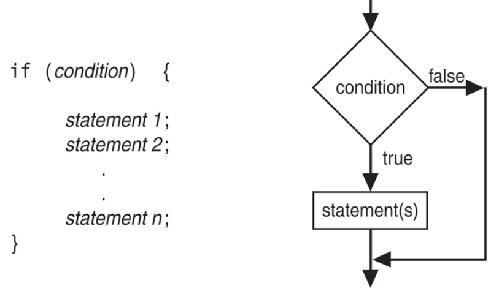
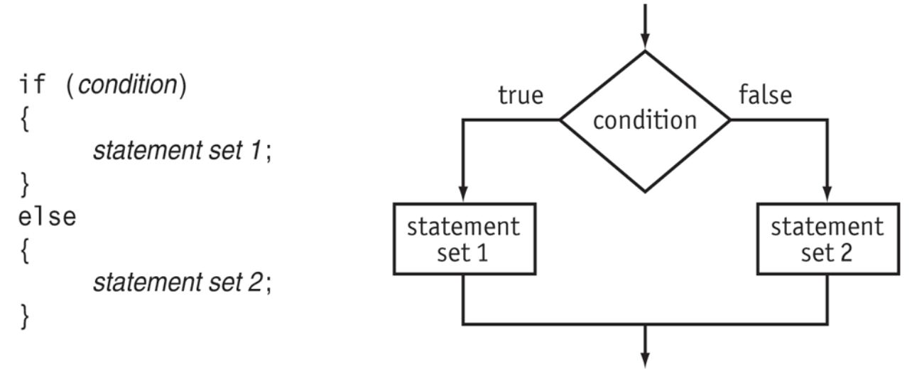
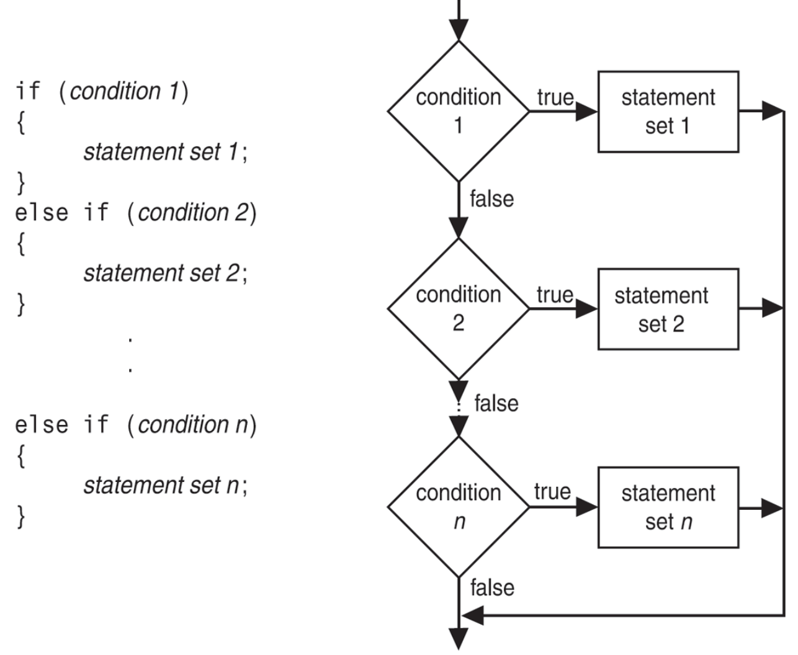
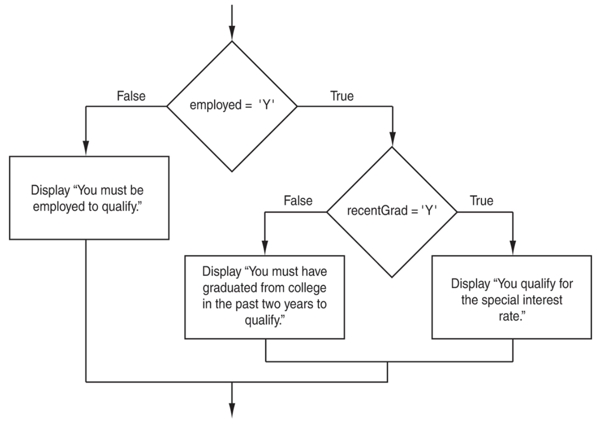
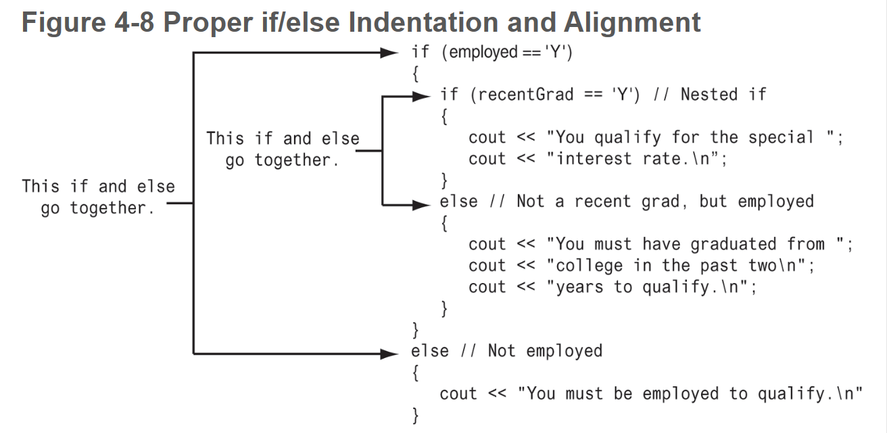
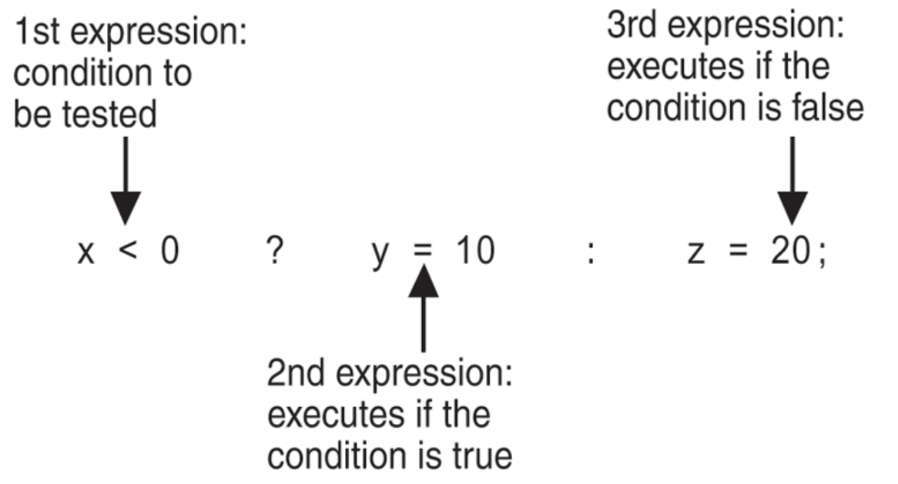
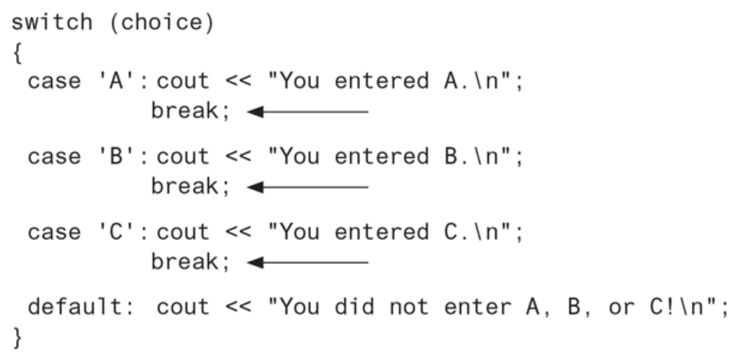

# Chapter 4: Making Decisions

## Table of Contents

- [4.1 Relational Operators](#41-relational-operators)
- [4.2 The `if` Statement](#42-the--if--statement)
- [4.3 The `if/else` Statement](#43-the--if-else--statement)
- [4.4 The `if/else if` Statement](#44-the--if-else-if--statement)
- [4.5 Menu-Driven Programs](#45-menu-driven-programs)
- [4.6 Nested `if` Statements](#46-nested--if--statements)
- [4.7 Logical Operators](#47-logical-operators)
  * [C++ Logical Operators](#c---logical-operators)
  * [Logical AND Truth Table](#logical-and-truth-table)
  * [Logical OR Truth Table](#logical-or-truth-table)
  * [Logical NOT Truth Table](#logical-not-truth-table)
  * [Precedence of Logical Operators](#precedence-of-logical-operators)
- [4.8 Validating User Input](#48-validating-user-input)
- [4.9 More about Blocks and Scope](#49-more-about-blocks-and-scope)
    + [Variables with the Same Name](#variables-with-the-same-name)
- [4.10 More about Characters and Strings](#410-more-about-characters-and-strings)
    + [ASCII Values of Commonly Used Characters](#ascii-values-of-commonly-used-characters)
    + [Character Testing Functions](#character-testing-functions)
- [4.11 The Conditional Operator](#411-the-conditional-operator)
- [The `switch` Statement](#the--switch--statement)
- [4.13 Enumerated Data Types](#413-enumerated-data-types)


------


## 4.1 Relational Operators

A _menu_ is a set of choices to the user. A _menu-driven_ program allows the user to determine the course of action by selecting it from the menu.

| **Relational Operators** | **Meaning**              |
| ------------------------ | ------------------------ |
| `>`                      | Greater than             |
| `<`                      | Less than                |
| `>=`                     | Greater than or equal to |
| `<=`                     | Less than or equal to    |
| `==`                     | Equal to                 |
| `!=`                     | Not equal to             |


## 4.2 The `if` Statement

The `if` statement can cause other statements to execute only under certain conditions. It’s a way of “short circuiting” code. It allows for decision-making in your program.




* When a relational expression is `true`, it has a nonzero value, which in most cases is represented by the value `1`.
* When a relational expression is false, it has the value `0`.
* An expression that has the value `0` is considered `false` by the `if` statement. This includes the `bool` value `false`, which is the equivalent to `0`.
* An expression that has _any_ value other than `0` is considered `true`. This includes the `bool` value `true`, which is equivalent to `1`.

```C++
// curly braces are optional for one-line conditionals
if (salesQuotaMet)
    cout << "You have met your sales quota!\n";

// is equivalent to
if (salesQuotaMet != 0) {
    cout << "You have met your sales quota!\n";
}
```


## 4.3 The `if/else` Statement



The `else` part at the end of the `if` statement specifies one or more statements that are to be executed when the condition is `false`.


## 4.4 The `if/else if` Statement

The `if/else if` statement is a chain of `if` statement. They perform their tests, one after the other, until one of them is found to be true.




## 4.5 Menu-Driven Programs

A _menu_ is a set of choices presented to the user. A _menu-driven program_ allows the user to determine the course of action by selecting it from the menu. From here, you’d either use a `switch/case` statement (which we’ve yet to cover) or an `if/else if` statement.


## 4.6 Nested `if` Statements

To test more than one condition, an `if` statement can be nested inside another `if` statement.







## 4.7 Logical Operators

Logical operators connect two or more relational expressions into one or reverse the logic of an expression.


### C++ Logical Operators

| **Operator** | **Meaning** | **Effect**                                                   |
| ------------ | ----------- | ------------------------------------------------------------ |
| `&&`         | AND         | Connects two expressions into one. Both expressions must be true for the overall expression to be true. |
| `||`         | OR          | Connects two expressions into one. One or both expressions must be true for the overall expression to be true. It is only necessary for one to be true, and it does not matter which. |
| `!`          | NOT         | Reverses the “truth” of an expression. It makes a true expression false, and a false expression true. |


### Logical AND Truth Table

| **Expression**   | **Value of the Expression** |
| ---------------- | --------------------------- |
| `false && false` | `false (0)`                 |
| `false && true`  | `false (0)`                 |
| `true && false`  | `false (0)`                 |
| `true && true`   | `true (1)`                  |


### Logical OR Truth Table

| **Expression**   | **Value of the Expression** |
| ---------------- | --------------------------- |
| `false || false` | `false (0)`                 |
| `false || true`  | `true (1)`                  |
| `true || false`  | `true (1)`                  |
| `true || true`   | `true (1)`                  |


### Logical NOT Truth Table

| **Expression** | **Value of the Expression** |
| -------------- | --------------------------- |
| `!false`       | `true (1)`                  |
| `!true`        | `false (0)`                 |


### Precedence of Logical Operators

* `!`
* `&&`
* `||`

The `&&` and `||` operators rank lower in precedence than relational operators, which means that relational expressions are evaluated before their results are logically AND’ed or OR’ed.

```C++
a > b && x < y 
// is the same as
(a > b) && (x < y)
    
a > b || x < y
// is the same as 
(a > b) || (x < y)
```


## 4.8 Validating User Input

_Input validation_ is the process of inspecting information given to a program by the user determining if it is valid. A good program should give clear instructions about the kind of input that is acceptable, but still not assume the user has followed the instructions.

* Numbers are checked to ensure they are within a range of possible values
* Values are checked for their “reasonableness”
* Items selected from a menu or some other set of choices are checked to ensure they are available options
* Variables are checked for values that might cause problems, such as division by zero


## 4.9 More about Blocks and Scope

The scope of a variable is limited to the block in which it is defined. Surrounding one or more programming statements with curly braces defines a **block of scope**. Block scope and local scope are synonymous. 

When a program is running and it enters the section of code that constitutes a variable’s scope, it is said that the variable _comes into scope_. This simply means the variable is now visible and the program may reference it. Likewise, when a variable _leaves scope_, it may no longer be used.


#### Variables with the Same Name

When a block is nested inside another block, a variable defined in the inner block may have the same name as a variable defined in the outer block. This is generally not considered a good idea, as it can lead to confusion. However, it is permitted. When the variable in the inner block comes into scope, the variable in the outer block becomes “hidden” and cannot be used.


## 4.10 More about Characters and Strings

Relational operators can also be used to compare characters and `string` objects. Strings are converted to their ASCII values prior to comparison.


#### ASCII Values of Commonly Used Characters

| **Character** | **ASCII Value** |
| ------------- | --------------- |
| ‘0’ - ‘9’     | 48 - 57         |
| ‘A’ - ‘Z’     | 65 - 90         |
| ‘a’ - ‘z’     | 97 - 122        |
| blank         | 32              |
| period        | 46              |


#### Character Testing Functions

| **Character Function** | **Description**                                              |
| ---------------------- | ------------------------------------------------------------ |
| `isalpha`              | Returns `true` if the argument is a **letter of the alphabet**. Otherwise, it returns `false`. |
| `isalnum`              | Returns `true` if the argument is a **letter of the alphabet or a digit**. Otherwise, it returns `false`. |
| `isdigit`              | Returns `true` if the argument is a **digit from 0 to 9**. Otherwise, it returns `false`. |
| `islower`              | Returns `true` if the argument is a **lowercase letter**. Otherwise returns `false`. |
| `isprint`              | Returns `true` if the argument is a **printable character (including a space)**. Otherwise, it returns `false`. |
| `ispunct`              | Returns `true` if the argument is a **printable character other than a digit, letter, or space**. Otherwise, it returns `false`. |
| `isupper`              | Returns `true` if the argument is an **uppercase letter**. Otherwise, it returns `false`. |
| `isspace`              | Returns `true` if the argument is a **whitespace character**. Otherwise, it returns `false`. Whitespace characters are any of the following:<br />**space**: `‘ ’`, **vertical tab**: `‘\v’`, **newline**: `‘\n’`, **tab:** `‘\t’` |

*Must assign the return values to a variable of the correct type in order for them to be converted to the correct literal value, rather than the ASCII integer value.


## 4.11 The Conditional Operator

You can use the conditional operator to create short expressions that work like `if/else` statements. This is also known as a ternary.

```C++
a = expression ? do_this_if_exp_is_true : do_this_if_exp_is_false;
```




The parentheses are placed around the conditional expression because the `<<` operator has higher precedence than the `?:` operator. Without the parentheses, just the value of the expression `score < 60` would be sent to `cout`.

```C++
cout << "Your grade is: " << (score < 60 ? "Fail." : "Pass.");
```


## The `switch` Statement

The `switch` statement uses the value of a variable or expression to determine where the program will branch to.



The `break` statement causes the program to exit the `switch` statement. The next statement executed after encountering a `break` statement will be whatever statement follows the closing brace that terminates the entire `switch` statement.

`switch` is an alternative to using a series of `if/else if` statements that only check if the value or a  variable or expression matches a certain value:

```C++
if (name == "Jon")
    height = 72;
else if (name == "Paul")
    height = 74;
else if (name == "Mary")
    height = 63;
else
    height = 60;

// is the same as:
switch(name)
{
    case "Jon": height = 72;
        break;
    case "Paul": height = 74;
        break;
    case "Mary": height = 63;
        break;
    default: height = 60;
}
```


## 4.13 Enumerated Data Types

An **enumerated data type** in C++ is a programmer-defined data type whose legal values are a set of named integer constants. It is called an **enumerated type** because the named constants are _enumerated_, or listed, as part of the definition of the data type.

```c++
enum Roster { Tom, Sharon, Bill, Teresa, John };
// Roster is the named data type
// Tom, Sharon, Bill, Teresa, and John are named integer constants called enumerators
// Tom = 0
// Sharon = 1
// Bill = 2
// Teresa = 3
// John = 4
```

* enums are typically capitalized
* this statement does not actually create any variables, it just defines the data type
* by default, the values assigned are 0, 1, 2, 3, etc.

```c++
Roster student;
student = Sharon;
if (student == Sharon) OR if(student == 1)	// will return true             
```

Custom values:

```c++
enum Department { factory = 1, sales = 2, warehouse = 4 };
```

* Custom values must always be integers because enums are always integers.

* If you don’t assign a custom value to some symbols, they will be defaulted to start at 0 and increment relative to the preceding symbol

  ```c++
  enum Colors { red, orange, yellow = 9, green, blue };
  // red = 0
  // orange = 1
  // yellow = 9
  // green = 10
  // blue = 11
  ```

