# Chapter 5: Looping

## Table of Contents


------


## 5.1 Introduction to Loops: The `while` Loop

A loop is a part of a program that repeats. For a `while` loop, there’s a _loop header_ that consists of a key word `while` followed by a _condition_ to be tested enclosed in parentheses. The _body_ contains statements to be executed while the condition is `true`.

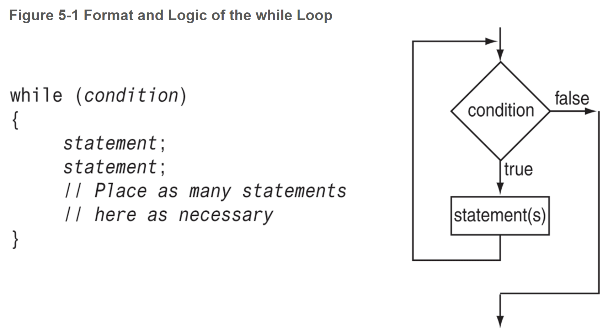

`while` is a _**pretest loop**_. It tests its condition before each iteration. If the test expression is false, the loop will not iterate. 

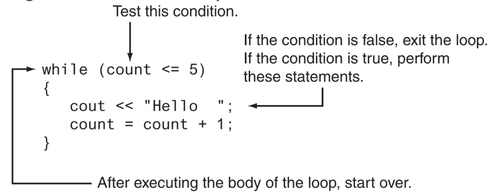


## 5.2 Using the `while` Loop for Input Validation

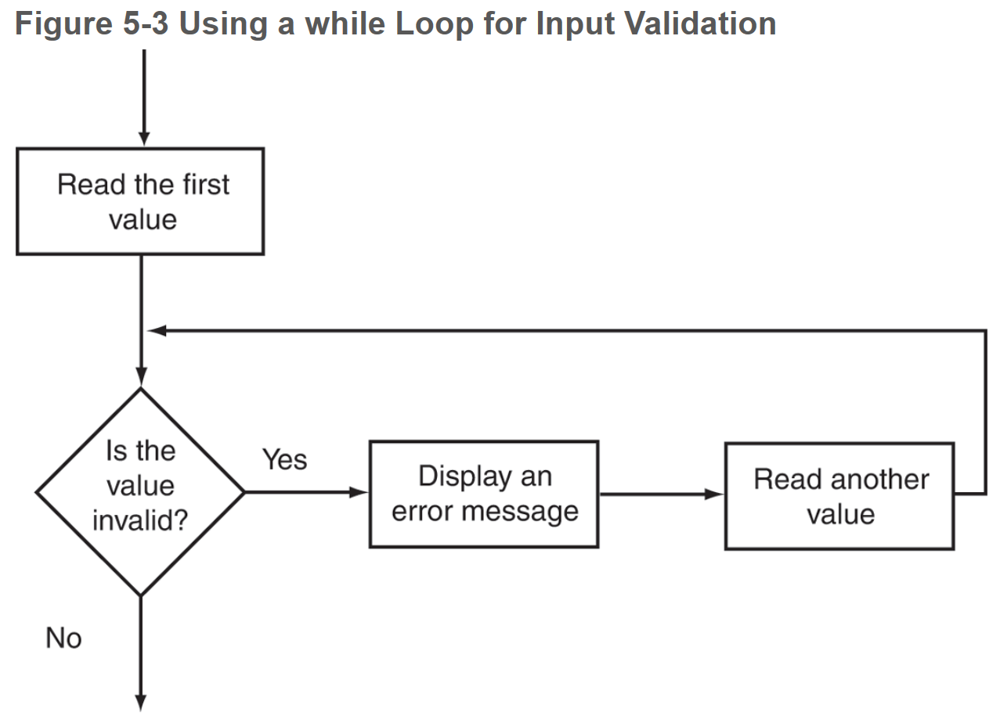


## 5.3 The Increment and Decrement Operators

`++` Increment by 1

`–` decrement by 1

**postfix mode**: the operator is placed after the  variable

```c++
num = 4;
cout << num++;	// will print 4 because the variable will be displayed before it is incremented
```

**prefix mode**: the operator is placed before the variable name

```c++
num = 4;
cout << ++num	// will print 5 because the variable is incremented before being read
```

*It’s generally not recommended to place increment or decrement operators in `cout` statements.


#### Using `++` and `--` in Mathematical Expressions & Relational Expressions

```c++
a = 2;	
b = 5;			// 2) 5++ = 6
c = a * b++;	// 1) a * b = 10; THEN b is incremented
cout << a << " " << b << " " << c;
//output:
2 6 10
---------------------------------------------------------------------------
a = 2;
b = 5;			// 1) b is incremented; b = 6
c = a * ++b;	// 2) 2 * 6 = 12 
//output:
2 6 12
```


## 5.4 Counters

A **counter** is a variable that is regularly incremented or decremented each time a loop iterates. This is often used to control `while` loops, but you will have to increment/decrement the counter at the end of your block manually. Counters are also integral to `for` loops, where the logic is handled in the loop header.


# 5.5 Keeping a Running Total

A running total is a sum of numbers that accumulates with each iteration of a loop. The variable used to keep the running total is called the accumulator.

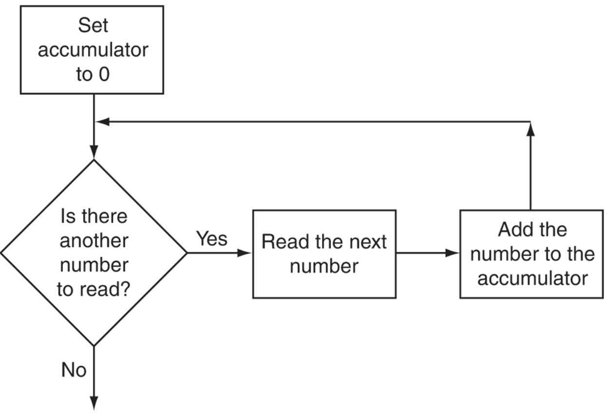


## 5.6 Sentinels

A **sentinel** is a special value that marks the end of a list of values. It cannot be mistaken for a member of the list, as it will be a signal that there are no more values to be entered. The loop that allows the data to be input continues iterating until the user enters the sentinel. Then the loop terminates. This is called a **_sentinel-controlled loop_**.

* Essentially, you’re instructing the user to input a specific value to let the program know when they are finished.
  * e.g. “Enter the number of points your team earned for each game so far this season. Then, enter -1 when finished.”


## 5.7 The `do-while` Loop

The `do-while` loop is a **post-test loop**, which means the expression is tested _after_ each iteration. It will always run at least once.

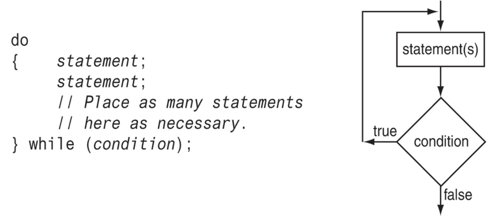

*The `do-while` loop must be terminated with a semicolon after the closing parenthesis of the test expression.


## 5.8 The `for` Loop

The `for` loop is a **pretest loop** that combines the initialization, testing, and updating of a loop control variable in a single loop header.

* **conditional loop**: executes as long as a particular condition exists
  * `while` loop - (example: input validation)
  * `do-while` loop
* **count-controlled loop**: repeats a specific number of times
  * `while` loop (with counter)
  * `for` loop

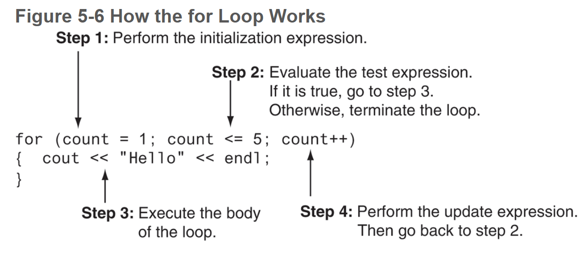

```c++
for (initialization; test; update)
{
	statement;
	statement;
	// etc etc
}
```


## 5.9 Deciding Which Loop to Use

#### The `while` Loop

* A pretest loop
* Ideal in situations where you do not want the loop to iterate if the test condition is false from the beginning

#### The `do-while` Loop

* A post-test loop
* Ideal in situations where you always want the loop to iterate at least once

#### The `for` Loop

* A pretest loop
* Ideal in situations where the exact number of iterations is known


## 5.10 Nested Loops

A loop that is inside another loop is called a _nested loop_.

Think of each loop as a rotating wheel. The outer loop is a big wheel that is moving slowly. The inner loop is a smaller wheel that is spinning quickly. For every rotation the big wheel makes, the little wheel makes many rotations. 

* An inner loop goes through all of its iterations for each iteration of an outer loop.
* Inner loops complete their iterations faster than outer loops.
* To get the total number of iterations of an inner loop, multiply the number of iterations of the outer loop by the number of iterations done by the inner loop each time the outer loop is done.


## 5.11 Breaking Out of a Loop

C++ Provides ways to break out of a loop or out of a loop iteration early. The `break` statement can also be placed inside a loop. When it is encountered, the loop immediately stops, and the program jumps to the statement following the loop. Normally, the only time a `break` statement is used inside a loop is to exit the loop early if an error condition occurs.

* In a nested loop, the `break` statement only interrupts the loop it is placed in.
* Because the `break` statement bypasses the loop condition to terminate a loop, it violates the rules of structured programming and makes code difficult to understand, debug, and maintain. It is **_not_ **recommended for exiting a loop.
* The `continue` statement causes all the statements in the body of the loop that appear after it to be ignored and the loop prepares for the next iteration. This also violates structured programming and is not recommended.

```C++
int testVal = 0;
while (textVal < 10)
{
	testVal++;
	if(testVal == 4)
		continue;	// terminate this iteration of the loop
	cout << testVal << " ";
}
```


## 5.12 Using Files for Data Storage

When a piece of data is written to a file, it is copied from a variable in RAM to the file. The term _output file_ is used to describe a file that data is written to.

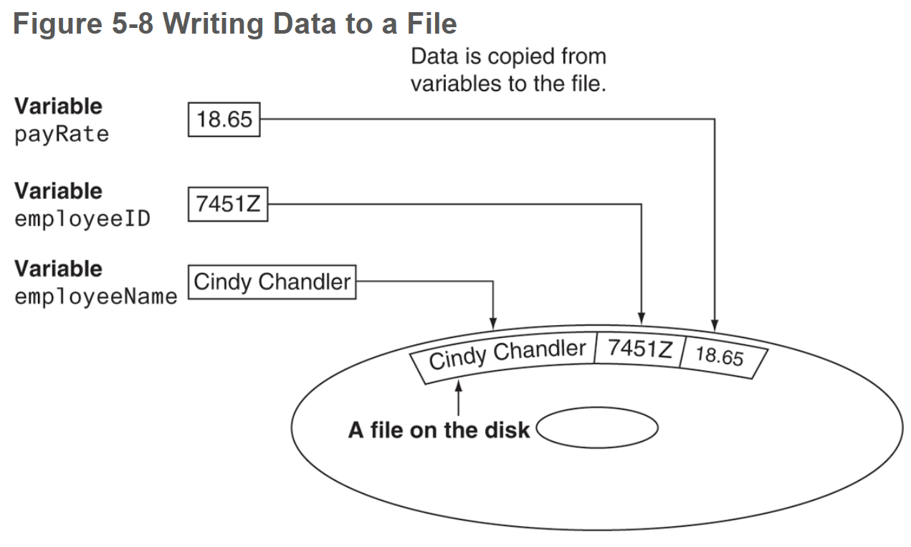

When a piece of data is read from a file, it is copied from the file into a variable in RAM. The term _input file_ is used to describe a file that data is read from.

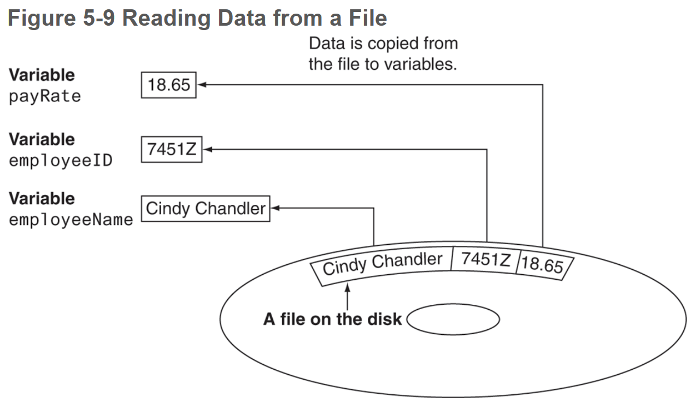


**text file**: data that has been encoded as text, using a scheme such as ASCII or Unicode. Even if the file contains numbers, those numbers are stored in the file as a series of characters. As a result, the file may be opened and viewed in a text editor such as Notepad.

**binary file**: data that has not been converted to text. As a consequence, you cannot view the contents of a binary file with a text editor.

**sequential access**: accessing data from the beginning of the file to the end of the file. If you want to read a piece of data that is stored at the very end of the file, you have to first read all the data that comes before it. You cannot jump directly to the desired data like you can with random access files.

**direct access / random access**: directly access any piece of data in the file without reading the data that comes before it. This is similar to the way a CD player or MP3 player works. You can jump directly to any song that you want to listen to.


In order for a program to work with a file on the computer’s disk, the program must create a **file stream object** in memory. A file stream object is an object that is associated with a specific file and provides a way for the program to work with that file. It is called a **stream object** because it enables streams of data to be copied from memory to a file and from a file to memory.


#### Setting Up a Program for File Input/Output

1. Include the header file needed to perform file input/output.
2. Define a file stream object.
3. Open the file.
4. Use the file.
5. Close the file.


The `fstream` file contains all the declarations necessary for file operations.

```c++
#include <fstream>
```

The `fstream` header file defines the data types `ofstream`, `ifstream`, `fstream`. Before a C++ program can work with a file, it must define an object of one of these data types. The object will be “linked” with an actual file on your computer’s disk, and the operations that may be performed on the file depend on which of these three data types you pick for the file stream object.

| **File Stream Data Type** | **Description**                                              |
| ------------------------- | ------------------------------------------------------------ |
| `ofstream`                | This stands for **output file `stream`** and is pronounced ‘o’ ‘f’ stream. An object of this data type can be used to **create a file and write data to it**. |
| `ifstream`                | This stands for **input file `stream`** and is pronounced ‘i’ ‘f’ stream. An object of this data type can be used to **open an existing file and read data from it**. |
| `fstream`                 | This stands for **file `stream`** and is pronounced ‘f’ stream. An object of this data type can be used to **open files for reading, writing, or both**. |


#### Creating a File Stream Object and Opening a File

Before data can be written to or read from a file, two things must happen:

* A **file stream object** must be created.
* The file must be opened and linked to the file stream object.

```C++
// OPENING A FILE FOR INPUT (READING)
ifstream inputFile;	 // define an ifstream object named inputFile
inputFile.open("customers.txt");	// call the object's open member function, pass the file path, and link it to the inputFile object
//alternatively:
ifstream inputFile("customers.txt");
----------------------------------------------------------------------
// OPENING A FILE FOR OUTPUT (WRITING)
ofstream outputFile;	// define an ofstream object named outputFile
outputFile.open("employees.txt");	// call the object's open member function, pass the file path. This will open a file named employees.txt and link it with outputFile. It will create or overrite a file named employees.txt.
//alternatively:
ofstream outputFile("employees.txt");
```

* Two backslashes are needed in file paths. They represent one backslash in a string literal. 

  ```
  inputFile.open("C:\\data\\inventory.txt");
  ```


#### Closing a File

* Most OS’s temporarily store data in a **_file buffer_** before being written to a file. A file buffer is a small “holding section” of memory that file-bound data is first written to. The data is not actually written to the file until the buffer is full. This is done to improve the system’s performance because doing file I/O is much slower than processing data in memory. Closing a file causes any unsaved data still in a buffer to be written out to its file. This ensures that all the data the program intended to write to the file is actually in it if you need to read it back in later in the same program.
* Some OS’s  limit the number of files that may be open at one time. When a program closes files that are no longer being used, it will not deplete more of the OS’s resources than necessary.

```c++
inputFile.close();
```


#### Writing Data to a File

You can use the **stream insertion operator**, `<<`, to write data to a file:

```C++
ofstream outputFile("employees.txt");
outputFile << "Laura\n";
```


#### Reading Data from a File

```C++
ifstream inputFile("customers.txt");
inputFile >> customers;
```


#### The Read Position

When a file is opened for input, the file stream object internally maintains a special value known as a **read position**. A read position marks the location of the next byte that will be read from the file. When an input file is opened, its read position is initially set to the first byte in the file. 

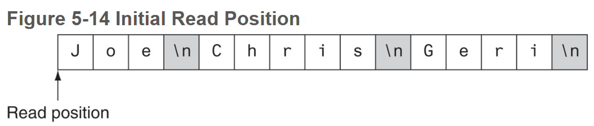

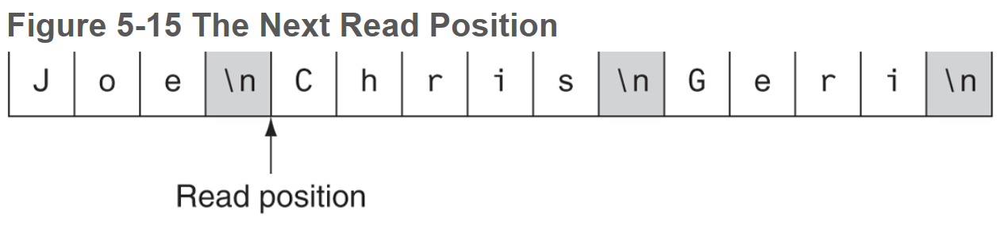

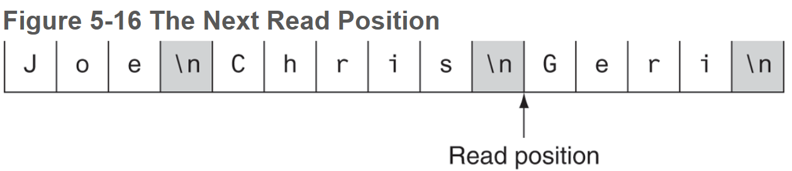

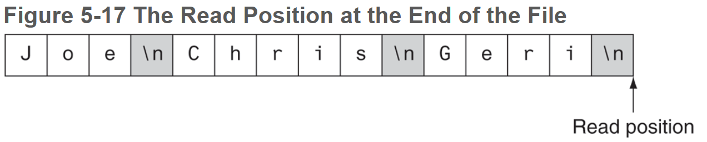

* The `>>` operators extracts data from a file and expects to read pieces of data that are separated by whitespace characters (spaces, tabs, or newlines).
* The easiest way to test if the end of a file has been reached is with the `>>` operator. This operator not only can read data from a file, but it also returns a true or false value indicating whether or not the data was successfully read. If the operator returns true, then the value was successfully read. if the operator returns false, it means that no value was read from the file and the end of file (EOF) has been reached.