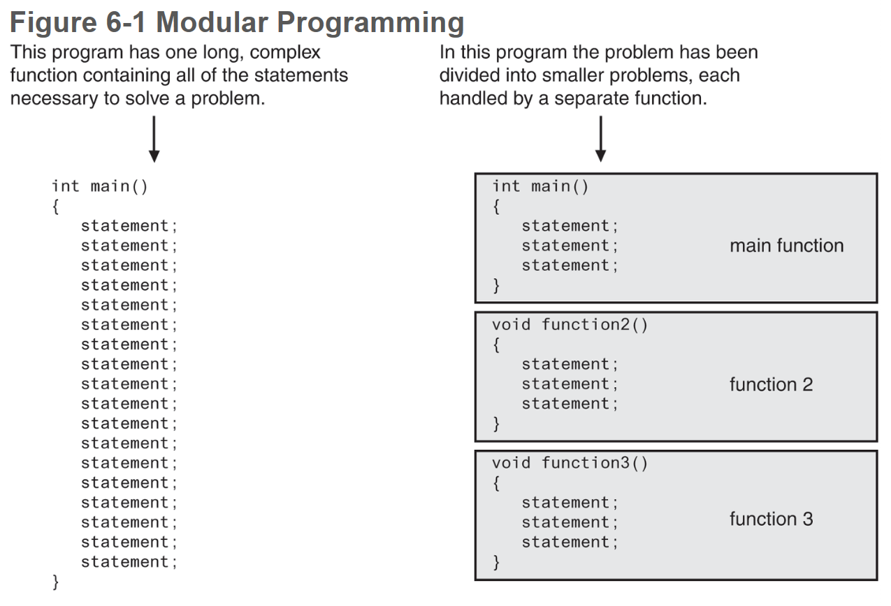
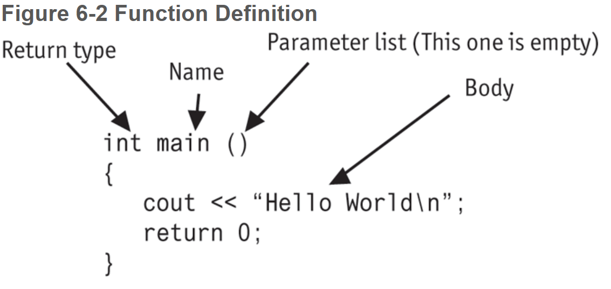
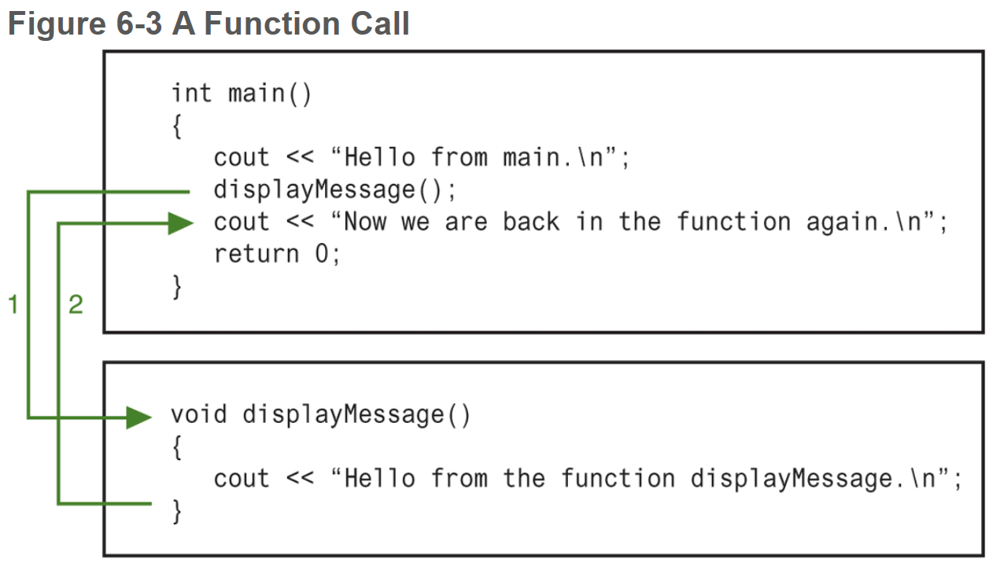
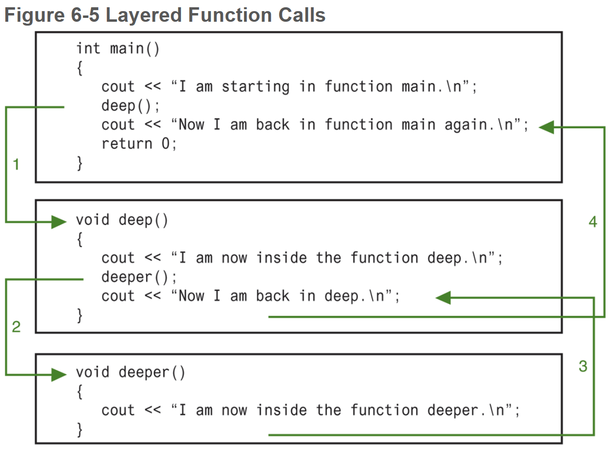
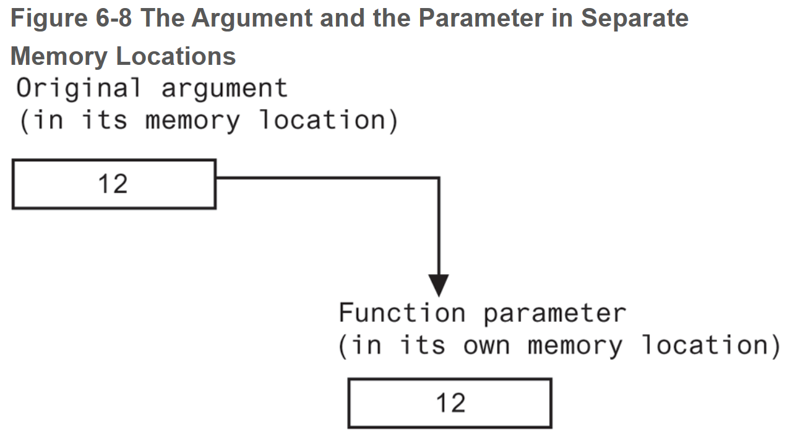
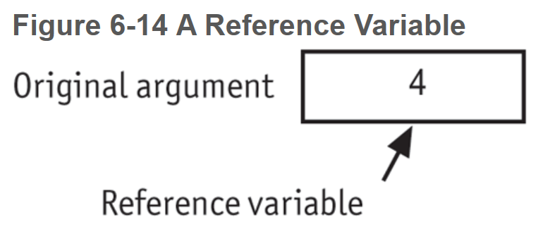

# Chapter 6: Functions

## Table of Contents

- [6.1 Modular Programming](#61-modular-programming)
- [6.2 Defining and Calling Functions](#62-defining-and-calling-functions)
- [6.3 Function Prototypes](#63-function-prototypes)
- [6.4 Sending Data into a Function](#64-sending-data-into-a-function)
- [6.5 Passing Data by Value](#65-passing-data-by-value)
- [6.6 The `return` Statement](#66-the--return--statement)
- [6.7 Returning a Value from a Function](#67-returning-a-value-from-a-function)
- [6.8 Returning a Boolean Value](#68-returning-a-boolean-value)
- [6.9 Using Functions in a Menu-Driven Program](#69-using-functions-in-a-menu-driven-program)
    + [Clearing the Screen](#clearing-the-screen)
- [6.10 Local and Global Variables](#610-local-and-global-variables)
- [6.12 Static Local Variables](#612-static-local-variables)
- [6.12 Default Arguments](#612-default-arguments)
- [6.13 Using Reference Variables as Parameters](#613-using-reference-variables-as-parameters)
- [6.14 Overloading Functions](#614-overloading-functions)
- [6.15 The `exit()` Function](#615-the--exit----function)
- [6.16 Stubs and Drivers](#616-stubs-and-drivers)

------


## 6.1 Modular Programming

A program may be broken up into a set of manageable functions, or modules. This is called modular programming.

**function**: a collection of statements that performs a specific task. 




## 6.2 Defining and Calling Functions

A function call is a statement that causes a function to execute. A function definition contains the statements that make up the function.

| **Term**           | **Definition**                                               |
| ------------------ | ------------------------------------------------------------ |
| **Name**           | Every function must have a name. In general, the same rules that apply to variable names also apply to function names. |
| **Parameter list** | The program module that calls a function can send data to it. The parameter list is the list of variables that hold the values being passed to the function. It is enclosed in parentheses. If no values are being passed to the function, its parameter list is _empty_. |
| **Body**           | The body of a function is a set of statement that carries out the task the function is performing. |
| **Return type**    | A function can send a value back to the program module that called it. The return type is the data type of the value being sent back. |




**void function**: a function that does not return a value.

**calling a function**: calling, or _invoking_, a function is done by simply using the name of the function followed by a set of parentheses (with parameters, if any) and a semicolon.

**function prototype**: a function statement prior to its formal definition. It lets the compiler know about a function that will appear later in the program.







## 6.3 Function Prototypes

A **function prototype** eliminates the need to place a function definition before all calls to the function. Programs are read line by line, top to bottom. Unlike other programming languages, C++ does not include hoisting so functions need to be declared or prototyped before the function is used. If you call a function or reference a variable before it has been declared, the compiler will look for something that does not yet exist.

```c++
#include <iostream>

using std::cout;
using std::endl;

void displayMessage();	// function prototype
void displayAnotherMessage()	// function declaration
{
    cout << "Another message" << endl;
}

int main()
{
    cout << "Hello from main" << endl;
    displayMessage();
    displayAnotherMessage();
    return 0;
}

void displayMessage()	// function declaration
{
    cout << "Message" << endl;
}
```


## 6.4 Sending Data into a Function

**arguments** (_actual parameters/arguments_): values that are sent to a function when called.

**parameter** (_formal parameters/arguments)_: a special variable that holds a value being passed as an argument into a function. They are the variables which are part of the function’s signature (function definition). Think of them as placeholder variables.

```C++
void displayValue(int num)	// 'num' on this line is a parameter
{
cout << "The value is " << num << endl;
}
// later on, when we want to use our function
int val = 60;
displayValue(val);	// 'val' on this line is an argument
```

Each parameter must be preceded by their data type. 

```C++
void showSum(int num1, num2, num3)	// Error!
```

*_Order matters–make sure the order in which you’re passing in the arguments matches the order in which you’ve defined the parameters_

In a function prototype, it is not necessary to name the parameter variable.

```C++
void displayValue(int num);	// valid function prototype
void displayValue(int); 	// also a valid function prototype
```


## 6.5 Passing Data by Value

When an argument is passed into a parameter by value, only a copy of the argument’s value is passed. Changes to the parameter do not affect the original argument. For example, if you declare a variable, then pass it as an argument to a function, the value of that variable is sent to the function, not the variable itself.




## 6.6 The `return` Statement

The `return` statement causes a function to end immediately. When the last statement in a function has finished executing, the function terminates. The program returns to the module that called it and continues executing from the point immediately following the function call. `return` can short circuit the function, causing it to terminate early. This is common in conditional statements.


## 6.7 Returning a Value from a Function

A function may send a value back to the part of the program that called the function. In this case, you must specify the data type in the header of the function declaration.

```c++
int returnsAnInt(int num1)
{
	return num1;
}
```

You can then store the value of a _value-returning function_ in a variable.

```C++
int myNumber = returnsAnInt(6);
```


## 6.8 Returning a Boolean Value

Functions may return a `true` or `false` values. The expression returned may output a boolean, which may then be stored in a variable. Functions like these usually have named prefixed with “is” or “has”: `isValid`, `hasData`.


## 6.9 Using Functions in a Menu-Driven Program

Functions are ideal for use in menu-driven programs. When the user selects an item from a menu, the program can call the appropriate function. This allows a program to be modularized (broken into smaller, manageable pieces).


#### Clearing the Screen

You can clear the screen and place the cursor back at the top by calling the following commands:

```bash
// Unix-based systems
system("clear");

// Windows
system("cls");
```


## 6.10 Local and Global Variables

A **local variable **is defined inside a function and is not accessible outside the function. A **global variable** is defined outside all functions and is accessible to all functions in its scope. 

**local**: within a particular block scope, enclosed. 

* lifetime: at the time of execution; once the function ends, it is destroyed
* not automatically initialized like global variables are

**global**: outside any all blocks; accessible to all, “free-floating”

* if not initialized with a value, it is defaulted to 0
* global character values are initialized to NULL (stored as ASCII 0)
* lifetime: from the definition to the end of the program
* should be used sparingly:
  * can make debugging tricky–if its value is changed, it can affect other functions that use it so you’ll have to track down where it’s being changed
  * if a function uses that global variable and you want to use the function in a different program, it will break because it relies on that global variable

**global constant**: a named constant that is available to every function in a program. Because it is a constant, its value cannot be changed, so you won’t have to worry about the hazards associated with global variables.

* typically used for values that will never change and need to be used in multiple places
  * e.g. an interest rate, your company’s name
* makes it easy to edit your program if the value changes for some reason
  * e.g. the interest rate has changed


You can’t have two local variables with the same name in the same function. This includes parameters.  You can, however, have a parameter or local variable with the same name as a global or constant. This is called _shadowing_ because the global variable or constant will be hidden from that scope.

```C++
const int BIRDS = 500;

int getNumBirds()
{
	int BIRDS = 30;
	return BIRDS;
}

getNumBirds();	// returns 30
```


## 6.12 Static Local Variables

If a function is called more than once in a program, the values stored in the function’s local variables do not retain their value between function calls. This is because local variables are destroyed when a function terminates and are then re-created when the function starts again.

```C++
void getNumBirds()
{
	int BIRDS = 5;
	cout << BIRDS << endl;
	BIRDS = 20;
}

getNumBirds();	// 5
getNumBirds();	// 5
```

**static local variable**: a variable that is not destroyed when a function returns. The variable exists for the entire lifetime of the program, regardless of scope. Therefore the value can be updated within the function and the next time the function is called, the updated value is remembered.

* a variable is only initialized when it is first created
* likewise, a static variable is only initialized once during the running of the program

```C++
void showStatic()
{
	static int numCalls = 0;
	cout << "This function has been called " << ++numCalls << " times." << endl;
}

showStatic();	// "This function has been called 0 times."
showStatic();	// "This function has been called 1 times."
```


## 6.12 Default Arguments

Default arguments are passed to parameters automatically if no argument is provided in the function call. They should be assigned at the earliest occurrence of the function name (e.g. function prototypes).

```C++
void showArea(int = 20, int = 50);	// default args should be assigned at the earliest occurrence

void showArea(int length, int width)
{
	cout << length << " " << width << endl;
}

showArea();	// 20 50
showArea(55, 25);	// 55, 25
```

* The value of the default argument must be a literal value or a named constant.
* When an argument is left out of a function call (because it has a default value), all the arguments that come after it must also be left out.
* When a function has a mixture of parameters both with and without default arguments, the parameters with default arguments must be defined last.

```C++
// Illegal Prototype
void calcPay(doubleHours = 40.0, int empNum, double payRate);
```


## 6.13 Using Reference Variables as Parameters

**reference variable**: a variable that references the memory location of another variable. Any change made to the reference variable is actually made to the one it references. Reference variables are sometimes used as function parameters.

* an alias for another variable–it accesses the memory location of another variable
* prefixed with `&`
  * the ampersand must appear in both the prototype and the header
  * do not use in athefunction call
* _passed by reference_
* can be used as a parameter
  * changes made to that parameter actually change the data stored at that variable’s memory location
* use sparingly, mutating data makes debugging difficult




Reference variables are a way to mutate the original argument within a function. So, when that argument is used elsewhere, the changes made by the previous function call are maintained into the next call.

```c++
// the refVar parameter is a reference to an int
void doubleNum(int &refVar);
// later
int main()
{
    int value = 4;
    cout << "In main, value is " << value << endl;
    doubleNum(value);
    cout << "Now the value is " << value << endl;
    return 0;
}
void doubleNum(int &refVar) // equivalent to (int& refVar), (int&)
{
	refVar *=2;
}

// In main, value is 4
// Now the value is 8
```

**Common Use Cases**

* when the purpose of the function is to take in input values to be stored in variables of the calling function
* when two or more variables passed as arguments need to have their values changed by that function
* when a copy of an argument cannot reasonably or correctly be made
  * example: when the argument is a file stream object


## 6.14 Overloading Functions

**overload**: assigning the same name to multiple functions as long as their parameter lists are different.

* the number of parameters are different
* the parameter types are different

```C++
// functon prototypes
int square(int);
double square(double);

int main()
{
    int userInt = 5;
    double userReal = 5.2;
    
    // passing an int calls the first square function
    // passing a double calls the second square function
    cout << square(userInt) << " and " << square(userReal) << endl;
    return 0;
}

int square(int number)
{
    return number * number;
}

double square(double number)
{
    return number * number;
}

// OUTPUT: 25 and 27.04
```


In C++, each function has a signature. When an overloaded function is called, C++ uses this signature to distinguish it from other functions with the same name.

**function signature**: the name of the function and the data types of the function’s parameters in the proper order.

* the function’s return order is not part of the signature

```C++
square(int)
square(double)
```


## 6.15 The `exit()` Function

The `exit()` function causes a program to terminate regardless of which function or control mechanism is executing. By default, a program terminates once the `return` statement in `main()` is reached. `exit()` allows you to kill the program manually.

* takes an integer argument
  * 0 = successful program termination
    * `EXIT_SUCCESS`, part of the `cstdlib`, may also be used
  * 1 or any non-zero value = an error has occurred
    * `EXIT_FAILURE`, also part of the `cstdlib`, may be used
* use sparingly because it bypasses your program’s normal logical flow


## 6.16 Stubs and Drivers

Stubs and drivers are helpful tools for testing and debugging programs that use functions. They allow you to test the individual functions in a program, in isolation from the parts of the program that call the functions.

**stub**: a dummy function that is called instead of the actual function it represents. It usually displays a test message acknowledging it was called and nothing more. It’s a great way to test whether the function was called and that it executes properly.

**driver**: a program that tests a function by simply calling it. 

* if the function accepts arguments, test data is passed
* if the function returns a value, the return value is displayed
* a program that provides an environment to run multiple stubs