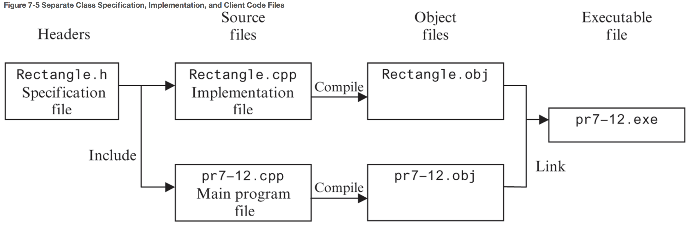

# Chapter 7: Introduction to Classes and Objects

## Table of Contents

- [7.1 Abstract Data Types](#71-abstract-data-types)
- [7.2 Object-Oriented Programming](#72-object-oriented-programming)
- [7.3 Introduction to Classes](#73-introduction-to-classes)
    + [Access Specifiers](#access-specifiers)
- [7.4 Creating and Using Objects](#74-creating-and-using-objects)
- [7.5 Defining Member Functions](#75-defining-member-functions)
- [7.6 Constructors](#76-constructors)
- [7.7 Destructors](#77-destructors)
- [7.8 Private Member Functions](#78-private-member-functions)
- [7.9 Passing Objects to Functions](#79-passing-objects-to-functions)
- [7.10 Object Composition](#710-object-composition)
- [7.11 Separating Class Specification, Implementation, and Client Code](#711-separating-class-specification--implementation--and-client-code)
    + [**Specification**](#--specification--)
    + [**Implementation**](#--implementation--)
    + [Main Program](#main-program)
    + [Steps to Create an Executable Program](#steps-to-create-an-executable-program)
- [7.12 Structures](#712-structures)
- [7.13 More about Enumerated Data Types](#713-more-about-enumerated-data-types)
- [7.14 Home Software Company OOP Case Study](#714-home-software-company-oop-case-study)
- [7.15 Introduction to Object-Oriented Analysis and Design](#715-introduction-to-object-oriented-analysis-and-design)
    + [Object-Oriented Analysis](#object-oriented-analysis)
    + [Relationships between classes](#relationships-between-classes)
    + [Finding the Classes](#finding-the-classes)

------


## 7.1 Abstract Data Types

An **abstract data type (ADT)** is a data type that specifies the values the data type can hold and the operations that can be done on them without the details of how the data type is implemented.

- Often can hold more than one value
- Normally used to refer to data types created by the programmer
- In Object-Oriented languages, ADTs are normally implemented as classes

An **_abstraction_ **is a general model of something. It is a definition that includes the general characteristics of an object without the details that characterize specific instances of the object. For example, most people know what a car is and how to operate it, but few understand how an engine works and how to repair it.


## 7.2 Object-Oriented Programming

**Object-oriented programming**: a method of writing software centered around **objects** that encapsulate both data and the functions that operate on them.

- **C++** is a combination of both procedural and OOP and is considered a hybrid language
- One of the main differentiators between C and C++ is that C++ has object orientation and classes

**Procedural programming**: a method of writing software centered on the procedures, or functions, that carry out the actions of the program. The program’s data, typically stored in variables, is separate from these procedures so you must pass the variables to the functions that need to work on them.

- **C** is a procedural programming language and does not support classes and objects


**attributes**: an object’s data items.

**member variables**: where attributes are stored.

**member functions (methods)**: the procedures than an object performs.

**encapsulation**: the bundling of an object’s data and procedures together.


*_The above figure is an example of an OOP modeling language called **Unified Modeling Language (UML)**. This diagram is considered a **class diagram**_.


**data hiding**: an object’s ability to hide its data from code outside the object. Only the object’s member functions can directly access and make changes to its data.

- Protects the internal data from accidental or intentional corruption
- Code outside the object does not need to know about the format or internal structure of the internal data; it only needs to interact with the object’s functions


## 7.3 Introduction to Classes

In C++, the **class** is the construct primarily used to create objects.

General format of a **class declaration**:

```C++
class ClassName	// Class declaration begins with
{				// the key word class and a name.
	/*
		Declarations for class member variables
		and member functions go here
	*/
};				// notice the required semicolon

ClassName objectName1,	// Class object definition
		  objectName2;	// these objects are instances of the class ClassName
```

#### Access Specifiers

_Access specifiers_ designate who can access various members of the class. Each access specifier is followed by a colon.

**`private`**: A private member variable can only be accessed by a function that is a member of the same class. A private member function can only be called by other functions that are members of the class.

- By default, everything is defaulted to being `private`.

**`public`**: A public member variable can be accessed by functions outside the class. A public member function can be called by functions outside the class.


## 7.4 Creating and Using Objects

Objects are **instances **of a class. They are created with a definition statement after the class has been declared.

Classes are like blueprints whereas objects are like houses constructed from those blueprints. Each house in this analogy is called an _instance_ of the class, and defining a class object is called _instantiating_ the class.

* Once a class has been instantiated, it occupies space in memory
  * The class is an abstract concept, it doesn’t occupy physical space until the house is manufactured

**dot notation**: `public` members of a class are accessed with the dot operator.

```C++
Classname objectName1;	// instantiate a Classname object
objectName.publicMethodName();	// call a public method on the Classname object
```

* **accessor**: a function that uses the value of a class variable but does not change it.
  * also known as **get functions** or **getter functions**
* **mutator**: a member function which stores a value in a member variable or changes its value.
  * also known as **set functions** or **setter functions**


## 7.5 Defining Member Functions

Class member functions can be defined either inside or outside the class declaration. 

**Inline function**: a class function that is defined in a class declaration.

- can only be used when a function body is very short, usually a single line

If a function body is longer, place a prototype for the function in the class declaration instead of the function itself. We then put the function definition _outside_ the class declaration, either following it or in a separate file.

**function implementation**:

```C++
void Classname::methodName(double r)	// '::' means these are class member fxns
{
    variableName = r;
}

double ClassName::method2Name()
{
    return 3.14 * pow(radius, 2);
}
```

**scope resolution operator `::`** indicates that the defined functions are class member functions. They tell the compiler which class the methods they belong to.

**stale data**: when the value of an item is dependent on other data and that item is not updated when the other data is changed.

- to avoid this, don’t store the result of any calculation functions in a variable


## 7.6 Constructors

A **constructor** is a special **public **member function that is automatically called to _construct_ a class object when it is created. If the programmer does not write a constructor, C++ automatically provides one. You never see it, but it runs silently in the background each time your program defines an object.

- most of the time, a constructor is used to initialize an object’s member variables
- it can do anything a normal function can do
- must be the same as the name of the class it is a part of
- not allowed to have a return type
- it is immediately invoked upon object instantiation

Constructors can be **overloaded**, meaning you can have multiple constructor functions as long as each constructor has a different list of parameters, creating a unique signature so that the compiler can tell them apart.

When passing in arguments to the constructor, the arguments must be passed to the class object instance:

```C++
class Sale
{
    private:
    	double taxPercentage;
    
    Sale()							// default constructor
    {
        taxPercentage = 5.0;
    }
    
    Sale(double taxRate)			// constructor that takes a taxRate argument
    {
        taxPercentage = taxRate * 100;
    }
}
Sale cashier2(.06);					// taxRate is passed to the constructor upon
									// class instantiation
```

**default constructor**: if a class has constructors that take arguments, a default constructor must be provided to account for the case where no argument is provided.

- If the program tries to create an object without passing arguments, it will not compile
- There can only be one default constructor
- can be created by providing a default argument


**member initialization list**: a list of member variable names with their initial values that appears after the constructor heading and before the opening brace of the body.

- includes the name of each variable to be initialized, followed by its initial value enclosed in parentheses:
  - `length(len), width(w)`
- multiple variables should be separated by commas
- no semicolon after the list
- initializations take place before any statements in the body of the constructor execute
- generally preferred because in some situations it allows the compiler to generate more efficient code

```C++
class Rectangle
{
    double area = 52.5;					// in-place member initialization
    Rectangle()
    {
        double length = 0,
        		width = 0;
    }
    Rectangle(double len, double w) :	// list can be placed on this line too
    	length(len), width(w)
    {

    }
}
```

*_**In-place member initialization** is new to C++ 11_

**constructor delegation**: when one constructor calls another constructor in the same class. This is also new to C++ 11.

```C++
class Contact
{
    private:
    	string name;
    	string email;
    	string phone;
    public:
    	//Default constructor
    	Contact() : Contact("", "", "")
        { }
    
    	// Constructor #2
    	Contact(string n, string e, string p)
        {
            name = n;
        	email = e;
            phone = p;
        }
}
```


## 7.7 Destructors

A **destructor** is a public member function that is automatically called when an object is destroyed.

- has the same name as the class, preceded by a tilde `~`
  - for example, `Rectangle`‘s destructor would be `~Rectangle`
- like constructors, destructors have no return type
- cannot accept arguments, so they have no parameter list
- there can only be one destructor
- most useful when working with objects that are dynamically allocated

```C++
class Demo
{
    public:
    	Demo();		// Constructor prototype
    	~Demo();	// Destructor prototype
};

Demo::Demo()		// Constructor function definition
{ }

Demo::~Demo()		// Destructor function definition
{ }
```


## 7.8 Private Member Functions

Private member functions may only be called from a function that is a member of the same class. You can think of them as helper functions because they help modularize public methods. 


## 7.9 Passing Objects to Functions

When an object is passed into a function, it passed by value, meaning the function receives a _copy_ of the object. Any changes made to that argument do not affect the original object. If the original object needs to be mutated, it should be passed by reference.

- Passing an object by value can slow the program’s execution time because it requires the value to be copied.

- Passing an object by reference is faster because no copy has to be made since the function has access to the original object. This is preferred.

- To avoid mutating the object’s member data, the object can be passed by _**constant reference**_, meaning the reference to the origin object is passed to the function, but it cannot access any of the object’s mutator functions or change any of the object’s data. It can only call accessor functions that have themselves been designated ad _**constant functions**_.

  ```c++
class InventoryItem
  {
    private:
    	int partNum;
    public:
    	int getPartNum() const		// const accessor function allows 
      {													// the function to be used when the
        return partNum;					// object is passed by constant reference
      }
    	int showValues(InventoryItem)
  }
  
  int showValues(const InventoryItem&);		// Function Prototype
  int showValues(const InventoryItem &item)	// Function Header
  ```
  
- you must add `const` to parameter list in both the function protype and header.

  ```C++
  void showValues(const InventoryItem&);
  void showValues(const InventoryItem &item)
  {
      
  }
  ```

Functions may also return objects:

```C++
InventoryItem storeValues()
{
    InventoryItem tempItem;	// Create local InventoryItem object
    int partNum;			// Local variables to hold user input
    string description;
    int qty;
    double price;
    
    // Code to get the data from the user goes here.
    
    // Store the data in the InventoryItem object and return it.
    tempItem.storeInfo(partNum, description, qty, price);
    return tempItem;
}
```


## 7.10 Object Composition

It is possible for a class to have a member variable that is an instance of another class.

**object composition** - when one classis nested in another class.


## 7.11 Separating Class Specification, Implementation, and Client Code

Usually, class declarations are stored in their own header files (`.hpp`) and member functions are stored in their own `.cpp` files.

- **Class declarations** are stored in their own **header files**. A header file that contains a class declaration is called a **_class specification file_**. The name of the class specification file is usuallt the same name of the class, with a `.h` extension. For example, the `Rectangle` class would be declared in the file `Rectangle.h`.
- Any program that uses the class should `#include` this header file.
- The member function definitions for a class are stored in a separate `.cpp` file, which is called the _**class implementation file**_. The file usually has the same name as the class, with the `.cpp` extension. For example, the `Rectangle` class member functions would be defined in the file `Rectangle.cpp`.
- The class `.cpp` file should be compiled and linked with the application program that uses the class. This program, also known as the _**client program**_, or _**client code**_, is the one that includes the `main` function. This process can be automated with a `project` or `make` utility. IDEs such as Visual Studio also provide the means to create multi-file projects.


#### **Specification**

**`Rectangle.h`**

```C++
// Rectangle.h is the Rectangle class specification file
#ifndef RECTANGLE_H
#define RECTANGLE_H

// Rectangle class declaration
class Rectangle
{
  private:
  	double length;
  	double width;
  public:
  	bool setLength(double);
  	bool setWidth(double);
  	double getLength();
  	double getWidth();
  	double calcArea();
};
#endif
```

**`ifndef`**: an _include guard_ that prevents the header file from accidentally being included more than once. It stands for “if not defined.” It is used to determine whether or not a specific constant has already been defined with another `#define` directive. The `#ifndef` directive checks for the existence of a constant named `RECTANGLE_H` and if it has not been defined yet, it will be defined in the next line. If it has, everything between the `#ifndef` and **`#endif`** directives is skipped.

- The constant used with this directive should be written in all capital letters and customarily named `FILENAME_H`, where `FILENAME` is the name of the header file.

When the main program has an `#include` directive for a header file, there is always the possibility that the header file will have an `#include` directive for a second header file. If your main program file also has an `#include` directive for the second header file, the preprocessor will include the second header file twice. An error will occur because the compiler will process the declarations in the second header file twice.


#### **Implementation**

**`Rectangle.cpp`**

```c++
// Rectangle.cpp is the Rectangle class function implementation file.
#include "Rectangle.h"									// specifies the header file is located 
																				// in the current project directory

bool Rectangle::setLength(double len)		// returns a bool that tells us whether
{																				// or not valid data was passed in
  bool validData = true;
  if (len >= 0)
    length = len;
  else
    validData = false;
  return validData;
}

bool Rectangle::setWidth(double w)
{
  bool validData = true;
  if (w >= 0)
    	width = w;
  else
    validData = false;
  return validData;
}

double Rectangle::getLength()
{
  return length;
}

double Rectangle::getWidth()
{
  return width;
}

double Rectangle::calcArea()
{
  return length * width;
}
```

**compiler include file directory**: the directory or folder where all standard C++ header files are located. Header files wrapped in angled brackets `< >` are part of the compiler’s include file directory.


#### Main Program

**`mainProgram.cpp`**

```c++
// This program uses the Rectangle class
// The Rectangle class declaration is in file Rectangle.h
// The rectangle member function definitions are in Rectangle.cpp
// These files should all be combined into a project
#include <iostream>
#include "Rectangle.h"			// contains Rectangle class declaration

using namespace std;

int main()
{
  Rectangle box;						// declare a Rectangle object
  double boxLength, boxWidth;
  
  cout << "This program will calculate the area of a rectangle. \n";
  cout << "What is the length? ";
  cin >> boxLength;
  cout << "What is the width? ";
  cin >> boxWidth;
  
  // Call member functions to set box dimensions.
  // If the function call returns false, it means the argument
  // sent to it was invalid and not stored.
  if (!box.setLength(boxLength))
    cout << "Invalid box length entered. \n";
  else if (!box.setWidth(boxWidth))
    cout << "Invalid box width entered. \n";
  else
  {
    cout << "\nHere is the rectangle's data:\n";
    cout << "Length: " << box.getLength() << endl;
    cout << "Width: " << box.getWidth() << endl;
    cout << "Area: " << box.calcArea() << endl;
  }
  return 0;
}
```


#### Steps to Create an Executable Program

1. The implementation file, `Rectangle.cpp`, should be compiled to create an object file. This file would typically be named `Rectangle.obj`.
2. The main program file, `mainProgram.cpp`, must be compiled to create an object file. This file would typically be named `mainProgram.obj`.
3. The object files `mainProgram.obj` and `Rectangle.obj` are linked together to create an executable file, which would be named something like `mainProgram.exe`.




## 7.12 Structures

A **structure** is a programmer-defined data type that can hold many different data values. It was used before OOP became common. It is used to group logically connected data together into a single unit. Once declared, multiple variables of this type can be created.

- Uses the keyword `struct`
- Creates a new data type
- Can include member functions but rarely do
- Does not include the access specifiers `public` or `private`
- Unlike class members, which are private by default, members of a structure **public **by default
- Names are capitalized like class names
- Cannot perform comparison operations on entire structures
- Each member must be displayed separately

```c++
struct Payroll
{
  int			empNumber;
  string	name;
  double	hours,
  				payRate,
  				grossPay;
};

Payroll employee;
employee.empNumber = 475;
employee.name = "Jon";
employee.hours = "40.0";
employee.payRate = "15.50";
employee.grossPay = "542.32"
  
cout << employee.name				// prints "Jon"
```


**initialization list** - a list of values to initialize a set of memory locations. 

```C++
struct Date
{
	int day,
		month,
		year;
}

// initialize a Date variable
Date birthday = {25, 12, 2000};
```

- If a structure member is uninitialized, you must leave all the members that follow it uninitialized as well.

- You cannot initialize a structure member in the declaration of a structure because the structure declaration creates a new data type and no variables of this type exist yet.
- You can use a constructor to initialize a structure and it does **not** need the keyword `public` since all structure members are public by default.
- Structures can also be nested


## 7.13 More about Enumerated Data Types

Enumerated data types can make programs more readable. They are custom data types that have a set of values called **enumerators**, which represent integer constants.

```C++
enum Car { PORSCHE, FERRARI, JAGUAR };	// declare an enumerated data type
Car sportsCar;		// define a variable of trhe type Car

enum Car { PORSCHE, FERRARI, JAGUAR } myCar, yourCar;	// declare and define an enumerated data type (two variables of the Car type)

myCar = PORSCHE;	// assign integer constant (enumerator) to myCar variable
```

If you must assign an integer value to an `enum` variable, you can do so by casting the integer to the `enum` data type.

```C++
myCar = static_cast<Car>(0);	// will produce the same result as myCar = PORSCHE

int myCar = PORSCHE;		// assign an enumerator to an integer value
Car otherCar = JAGUAR;		// create otherCar variable and assign enum JAGUAR
int yourCar = othercar;		// assign enum variable to yourCar
```

C++ 11 does not allow the same enumerator name to be a member of two different enumerated data types defined or used in the same scope. C++ 11 includes a _strongly typed enum_, also known as an **enum class** to get around this limitation.

- to retrieve a strongly typed enumerator’s underlying integer value, you must use a cast operator

```C++
enum class Presidents { MCKINLEY, ROOSEVELT, TAFT };
enum class VicePresidents { ROOSEVELT, FAIRBANKS, SHERMAN };

// when using a strongly typed enum, you must prefix ever enumerator you reference with the enum it belongs to
Presidents prez = Presidents::Roosevelt;
VicePresidents vp1 = VicePresidents::Roosevelt;
VicePresidents vp2 = VicePresidents::SHERMAN;

int x = static_cast<int>(Presidents::ROOSEVELT);	// retrieve underlying enum integer value

// notice we're specifying the integer data type 
enum class Water : unsigned { FREEZING = 32, BOILING = 212 };
```


## 7.14 Home Software Company OOP Case Study


## 7.15 Introduction to Object-Oriented Analysis and Design

Object-oriented analysis determines the requirements for a system to clarify what it must be able to do, what classes are needed, and how those classes are related. Object-oriented design then designs the classes and specifies how they will carry out their responsibilities.

#### Object-Oriented Analysis

1. **Identify **the classes and objects to be used in the program.
2. Define the **attributes **for each class.
3. Define the **behaviors **for each class.
4. Define the **relationships** between classes.


#### Relationships between classes

- Access - _Uses-a_
- Ownership (Composition) - _Has-a_
- Inheritance - _Is-a_


#### Finding the Classes

1. Get a written description of the problem domain.
2. Identify all the nouns (including pronouns and noun phases) in the description. Each of these is a potential class.
3. Refine the list to include only the classes that are relevant to the problem.

**Problem domain** - the set of real-world objects, parties, and major events related to the problem. 