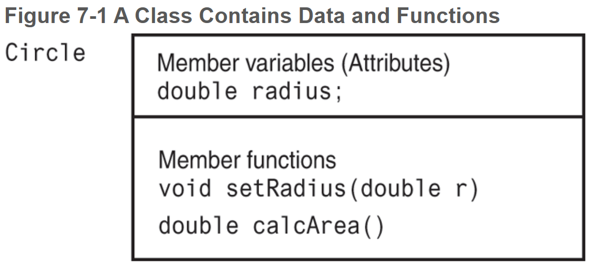

# Chapter 7: Introduction to Classes and Objects

## Table of Contents


------


## 7.1 Abstract Data Types

An **abstract data type (ADT)** is a data type that specifies the values the data type can hold and the operations that can be done on them without the details of how the data type is implemented.

- Often can hold more than one value
- Normally used to refer to data types created by the programmer
- In Object-Oriented languages, ADTs are normally implemented as classes

An **_abstraction_ **is a general model of something. It is a definition that includes the general characteristics of an object without the details that characterize specific instances of the object. For example, most people know what a car is and how to operate it, but few understand how an engine works and how to repair it.


## 7.2 Object-Oriented Programming

**Object-oriented programming**: a method of writing software centered around **objects** that encapsulate both data and the functions that operate on them.

- **C++** is a combination of both procedural and OOP and is considered a hybrid language
- One of the main differentiators between C and C++ is that C++ has object orientation and classes

**Procedural programming**: a method of writing software centered on the procedures, or functions, that carry out the actions of the program. The program’s data, typically stored in variables, is separate from these procedures so you must pass the variables to the functions that need to work on them.

- **C** is a procedural programming language and does not support classes and objects


**attributes**: an object’s data items.

**member variables**: where attributes are stored.

**member functions (methods)**: the procedures than an object performs.

**encapsulation**: the bundling of an object’s data and procedures together.



*_The above figure is an example of an OOP modeling language called **Unified Modeling Language (UML)**. This diagram is considered a **class diagram**_.


**data hiding**: an object’s ability to hide its data from code outside the object. Only the object’s member functions can directly access and make changes to its data.

- Protects the internal data from accidental or intentional corruption
- Code outside the object does not need to know about the format or internal structure of the internal data; it only needs to interact with the object’s functions


## 7.3 Introduction to Classes

In C++, the **class** is the construct primarily used to create objects.

General format of a **class declaration**:

```C++
class ClassName	// Class declaration begins with
{				// the key word class and a name.
	/*
		Declarations for class member variables
		and member functions go here
	*/
};				// notice the required semicolon

ClassName objectName1,	// Class object definition
		  objectName2;	// these objects are instances of the class ClassName
```

#### Access Specifiers

_Access specifiers_ designate who can access various members of the class. Each access specifier is followed by a colon.

**`private`**: A private member variable can only be accessed by a function that is a member of the same class. A private member function can only be called by other functions that are members of the class.

- By default, everything is defaulted to being `private`.

**`public`**: A public member variable can be accessed by functions outside the class. A public member function can be called by functions outside the class.


## 7.4 Creating and Using Objects

Objects are **instances **of a class. They are created with a definition statement after the class has been declared.

Classes are like blueprints whereas objects are like houses constructed from those blueprints. Each house in this analogy is called an _instance_ of the class, and defining a class object is called _instantiating_ the class.

* Once a class has been instantiated, it occupies space in memory
  * The class is an abstract concept, it doesn’t occupy physical space until the house is manufactured

**dot notation**: `public` members of a class are accessed with the dot operator.

```C++
Classname objectName1;	// instantiate a Classname object
objectName.publicMethodName();	// call a public method on the Classname object
```

* **accessor**: a function that uses the value of a class variable but does not change it.
  * also known as **get functions** or **getter functions**
* **mutator**: a member function which stores a value in a member variable or changes its value.
  * also known as **set functions** or **setter functions**


## 7.5 Defining Member Functions

Class member functions can be defined either inside or outside the class declaration. 

**Inline function**: a class function that is defined in a class declaration.

- can only be used when a function body is very short, usually a single line

If a function body is longer, place a prototype for the function in the class declaration instead of the function itself. We then put the function definition _outside_ the class declaration, either following it or in a separate file.

**function implementation**:

```C++
void Classname::methodName(double r)	// '::' means these are class member fxns
{
    variableName = r;
}

double ClassName::method2Name()
{
    return 3.14 * pow(radius, 2);
}
```

**scope resolution operator `::`** indicates that the defined functions are class member functions. They tell the compiler which class the methods they belong to.

**stale data**: when the value of an item is dependent on other data and that item is not updated when the other data is changed.

- to avoid this, don’t store the result of any calculation functions in a variable


## 7.6 Constructors

A **constructor** is a special public member function that is automatically called to _construct_ a class object when it is created. If the programmer does not write a constructor, C++ automatically provides one. You never see it, but it runs silently in the background each time your program defines an object.

- most of the time, a constructor is used to initialize an object’s member variables
- it can do anything a normal function can do
- must be the same as the name of the class it is a part of
- not allowed to have a return type
- it is immediately invoked upon object instantiation

Constructors can be **overloaded**, meaning you can have multiple constructor functions as long as each constructor has a different list of parameters, creating a unique signature so that the compiler can tell them apart.

When passing in arguments to the constructor, the arguments must be passed to the class object instance:

```C++
class Sale
{
    private:
    	double taxPercentage;
    
    Sale()							// default constructor
    {
        taxPercentage = 5.0;
    }
    
    Sale(double taxRate)			// constructor that takes a taxRate argument
    {
        taxPercentage = taxRate * 100;
    }
}
Sale cashier2(.06);					// taxRate is passed to the constructor upon
									// class instantiation
```

**default constructor**: if a class has constructors that take arguments, a default constructor must be provided to account for the case where no argument is provided.

- If the program tries to create an object without passing arguments, it will not compile
- There can only be one default constructor
- can be created by providing a default argument


**member initialization list**: a list of member variable names with their initial values that appears after the constructor heading and before the opening brace of the body.

- includes the name of each variable to be initialized, followed by its initial value enclosed in parentheses:
  - `length(len), width(w)`
- multiple variables should be separated by commas
- no semicolon after the list
- initializations take place before any statements in the body of the constructor execute
- generally preferred because in some situations it allows the compiler to generate more efficient code

```C++
class Rectangle
{
    double area = 52.5;					// in-place member initialization
    Rectangle()
    {
        double length = 0,
        		width = 0;
    }
    Rectangle(double len, double w) :	// list can be placed on this line too
    	length(len), width(w)
    {

    }
}
```

*_**In-place member initialization** is new to C++ 11_

**constructor delegation**: when one constructor calls another constructor in the same class. This is also new to C++ 11.

```C++
class Contact
{
    private:
    	string name;
    	string email;
    	string phone;
    public:
    	//Default constructor
    	Contact() : Contact("", "", "")
        { }
    
    	// Constructor #2
    	Contact(string n, string e, string p)
        {
            name = n;
        	email = e;
            phone = p;
        }
}
```


## 7. Destructors

A **destructor** is a member function that is automatically called when an object is destroyed.