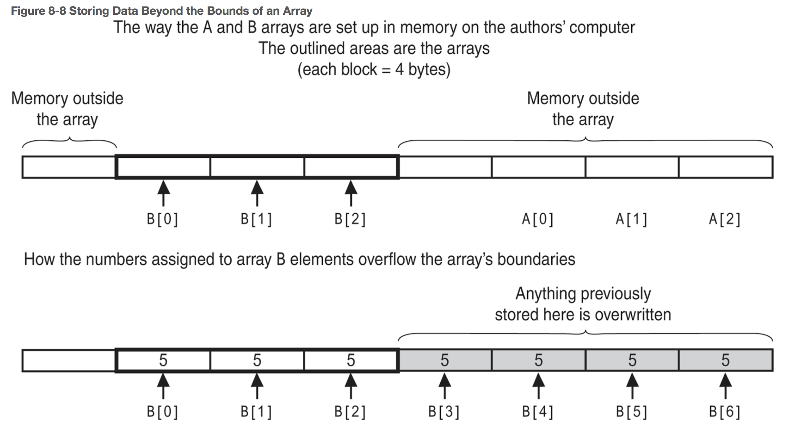
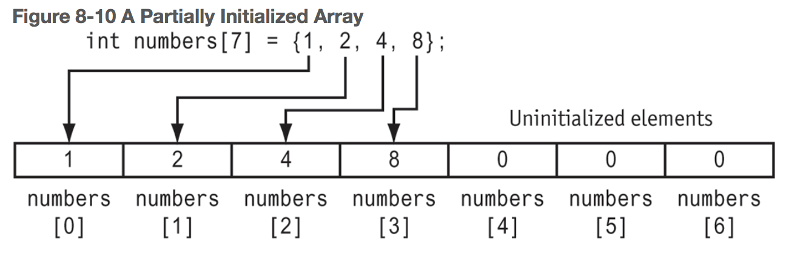
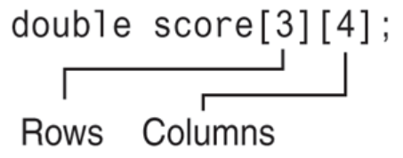
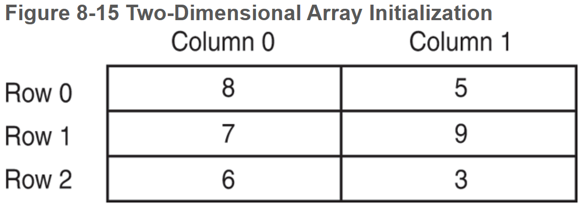
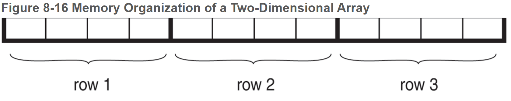

# Chapter 8: Arrays and Vectors

## Table of Contents

- [8.1 Arrays Hold Multiple Values](#81-arrays-hold-multiple-values)
- [8.2 Accessing Array Elements](#82-accessing-array-elements)
- [8.3 Inputting and Displaying Arrays](#83-inputting-and-displaying-arrays)
    + [Reading Data from a File into an Array](#reading-data-from-a-file-into-an-array)
    + [Writing the Contents of an Array to a File](#writing-the-contents-of-an-array-to-a-file)
- [8.4 Array Initialization](#84-array-initialization)
    + [New Ways to Initialize Variables](#new-ways-to-initialize-variables)
- [8.5 The Range-Based `for` Loop](#85-the-range-based--for--loop)
- [8.6 Processing Array Contents](#86-processing-array-contents)
    + [Copying One Array to Another](#copying-one-array-to-another)
    + [Strings](#strings)
- [8.7 Using Parallel Arrays](#87-using-parallel-arrays)
- [8.8 The `typedef` Statement](#88-the--typedef--statement)
- [8.9 Arrays as Function Arguments](#89-arrays-as-function-arguments)
- [8.10 Two-Dimensional Arrays](#810-two-dimensional-arrays)
    + [Passing Two-Dimensional Arrays to Functions](#passing-two-dimensional-arrays-to-functions)
- [8.11 Arrays with Three or More Dimensions](#811-arrays-with-three-or-more-dimensions)
- [8.12 Introduction to the STL `vector`](#812-introduction-to-the-stl--vector-)
    + [Example Vector Definitions](#example-vector-definitions)
- [8.13 Arrays of Objects](#813-arrays-of-objects)

------

## 8.1 Arrays Hold Multiple Values

An array allows you to store and work with multiple values of the same data type. 

```C++
int hours[6];			// array name, followed by its size declarator
```

**size declarator** - indicates the number of **elements**, or values, an array can hold.


## 8.2 Accessing Array Elements

**subscript** - used as an index to pinpoint a specific element in an array.

```C++
hours[0] = 20;	// assigns 20 to the first element in the array.
								// pronounced "hours sub zero"
```


## 8.3 Inputting and Displaying Arrays

Arrays can only be displayed one element at a time.


#### Reading Data from a File into an Array

```C++
ifstream inputFile;
inputFile.open('work.dat');
// Read the numbers from the file into the array. When we exit
// the loop, count will hold the number of items read in.
// iterate only as long as the array is not yet filled and the end of 
// the file has not yet been reached
while (count < NUM_EMPLOYEES && inputFile >> hours[count] )
	count++;
```

- contents must be input into the array one at a time

  

#### Writing the Contents of an Array to a File

C++ does not perform **array bounds checking**. This means you could write a program that accidentally allows an array’s subscript to go beyond its boundaries. On many systems it causes other nearby variables to have their contents overwritten, losing their correct value. On some systems it can even cause the computer to crash.




## 8.4 Array Initialization

Arrays may be initialized when they are defined. They may be spread across multiple lines.

```C++
int myArray[3] = {1, 2, 3};
cout << myArray[0];	// 1
```

- When an array is being initialized, C++ does not require a value for every element .

- ```c++
  int numbers[7] = {1, 2, 4, 8};
  ```

- 

- If you leave an element uninitialized, you must leave all elements that follow it uninitialized as well.

- You can define an array without specifying its size, but you must provide an initialization list that includes every element. C++ will count the number of items in the initialization list and give the array that many elements.

  ```c++
  double ratings[] = {1.0, 2.0, 1.5};
  ```

#### New Ways to Initialize Variables

**functional notation**

```c++
int value(5);		// initialize value to 5
```

**brace notation** 

- checks to make sure the value you are initializing the variable with matches the data type of the variable

```c++
int value{5};			// checks to make sure 5 is an int
int value1 = 4.9;	// stores 4 in value 1
```


## 8.5 The Range-Based `for` Loop

The range-based `for` loop is a loop that iterates once for each element in an array. Each time the loop iterates, it copies an element from the array to a variable. The range-based `for` loop was introduced in C++ 11.

```c++
for(dataType rangeVariable : array)
  statement;
```

- **`rangeVariable`** is a variable that will receive the value of a different array element during each loop iteration. During the first loop iteration, it receives the value of the first element; during the second iteration, it receives the value of the second element, and so on.
  
- `rangeVariable = array[index]` 
  
- You cannot modify the contents of an array in a range-based `for` loop  unless you declare the range variable as a _reference_.

  - To declare a range variable as a reference variable, place an `&` in front of its name in the loop header.

    ```c++
    for(datatype &rangeVariable : array)
      val = myNewValue;
    ```

- You can use the `auto` keyword with a reference range variable


## 8.6 Processing Array Contents

Individual array elements are processed like any other type of variable.

#### Copying One Array to Another

To copy the values from one array to another, you cannot simply assign one array to another array. You must loop through the first array and assign each value to the new array.

**Comparing arrays**

When you use the `==` operator with array names, the operator compares the beginning memory addresses of the arrays, not the contents of the arrays.

#### Strings

Strings are technically arrays and its characters can be accessed similarly to a normal array.


## 8.7 Using Parallel Arrays

When data items stored in two or more arrays are related and stored in the same order, the arrays are called **parallel arrays**.


## 8.8 The `typedef` Statement

The `typedef` statement allows an alias to bee created for an existing data type.

```c++
typedef <existing data type> <alias>;

// Example:
typedef int examScore;
examScore score1, score2;		// score1 and score2 are of type examScore (an int)
```

- This makes `score1` and `score2` integer variables and clarifies that they will be used to hold exam scores.

- `typedef` is most often used to provide a descriptive alias for an array of a specific purpose.

  ```c++
  typedef double score[100];	// creates an alias named score for a double array of size 100
   
  score finalExam;	// equivalent to double finalExam[100]
  ```


## 8.9 Arrays as Function Arguments

Individual elements of arrays and entire arrays can both be passed as arguments to functions.

- No one variable can hold an entire array full of data. Thus the name of an array without a subscript does no hold any data at all. Instead it holds the starting address of where the array is located in memory.

- When we pass an array to a function, we pass the name of the array. This means we’re actually sending it the _address_ of the array so _it_ can access the elements.

- Array parameters work like reference variables–they give the function direct access to the original array. Any changes made to the array parameter are actually made to the original array used as the argument.

  - You do not need to use `&` when passing an array to a function.

  - When you don’t want the function to modify the contents of the array, use the `const` keyword.

    ```C++
    void showValues(const int[], int);
    ```

    

```c++
dataType functionName(dataType array[], int size);	// function header
functionName(myArray[], ARRAY_SIZE);				// calling the function
```


## 8.10 Two-Dimensional Arrays

A two-dimensional array is like several identical arrays put together. It is useful for storing multiple sets of data. Think of them like tables, having rows and columns of elements.

To define a two-dimensional array, two size declarators are required. The first one is for the number of rows and  the second one is for the number of columns.



Elements in a two-dimensional array can be accessed using nested loops.

```c++
void showArray(int const array[][NUM_COLS], int numRows)
{
	for (int row = 0; row < numRows; row++)
    {
        for(int col = 0; col < NUM_COLS; col++)
        {
            cout << array[row][col] << " ";
        }
        cout << endl;	// line break after each row
    }
}
```


When initializing a two-dimensional array, it helps to enclose each row’s initialization list in a set of braces.

```c++
int hours[3][2] = {{8, 5}, {7, 9}, {6, 3}};
// OR
int hours[3][2] = {8, 5, 7, 9, 6, 3};
// OR
int hours[3][2] = {{8, 5},
                   {7, 9},
                   {6, 3}};
```



- The extra braces above also give you the ability to leave out initializers within a row without omitting the initializers for the rows that follow it.

  ```c++
  int table[3][2] = {{1}, {3, 4}, {5}};	// the uninitialized elements default to 0
  ```

  

#### Passing Two-Dimensional Arrays to Functions

When a two-dimensional array is passed to a function, the parameter type must contain a size declarator for the number of columns.

```c++
void showArray(const int[][NUM_COLS], int);		// Function Prototype
```


C++ requires the columns to be specified in the function prototype and header because of the way two-dimensional arrays are stored in memory. One row actually follows another.



The compiler needs to know how many bytes to separate the rows in memory. The number of columns is a critical factor in this calculation.

The required column information can also be provided with a `typedef` statement:

```c++
typedef int intTable[][4];
void showArray(intTable, int);					// Function prototype
void showArray(intTable arrayName, int numRows)	// Function header
```


## 8.11 Arrays with Three or More Dimensions

When writing functions that accept multidimensional arrays as arguments, you must explicitly state all but the first dimension in the parameter list.

```c++
void displaySeats(double [][5][8], int);		// Function prototype
```


## 8.12 Introduction to the STL `vector`

The **Standard Template Library** is a collection of _programmer-defined_ data types that are available to use in your C++ programs. These data types and algorithms are not part of the C++ language but were created in addition to the built-in data types. 

- `vector` is part of the `std` namespace.
- **containers** - data types defined in the STL, they store and organize data.
  - **sequence container** - organizes data in a sequential fashion.
  - **associative container** - organize data with keys, which allow rapid, random access to elements stored in the container.
- The `vector` data type is a sequence container that is like a one-dimensional array in the following ways:
  - A vector holds a sequence of values, or elements.
  - A vector stores its elements in contiguous memory locations.
  - You can use the array subscript operator `[]` to access individual elements in the vector.
- A vector has advantages over arrays:
  - You do not have to declare the number of elements that the vector will have.
  - If you add a value to a vector that is already full, the vector will automatically increase its size to accomodate the new value.
  - Vectors can report the number of elements they contain.

To use a vector:

```c++
#include <vector>

vector<int> numbers;		// if you want to declare a size, use numbers(SIZE) instead
```

- If you specify a size for a vector, the size declarator is in parentheses, not square brackets.
- There’s no need to declare a size but if you do, the vector can expand as you add values to it.


#### Example Vector Definitions

| **Definition Format**              | **Description**                                              |
| ---------------------------------- | ------------------------------------------------------------ |
| `vector<string> names;`            | This defines `names` as an empty vector of `string` objects. |
| `vector<int> scores(15);`          | This defines `scores` as a vector of 15 `ints`.              |
| `vector<char> letters(25, 'A');`   | This defines `letters` as a vector of 25 characters. Each element is initialized with ‘A’. |
| `vector<double> values2(values1);` | This defines `values2` as a vector of `doubles`. All the elements of `values1`, which is also a vector of `doubles`, are copied to `values2`. |
| `vector<int> length(12, 10, 6);`   | In C++ 11, this defines `length` as a vector of 3 `ints`, holding the values 12, 10, and 6. |

**`push_back(value)`** - a method that accepts a value as an argument and stores it in a new element placed at the end of the vector.

**`pop_back()`** - a method that removes the last element from a vector.

**`size()`** - a method that returns the lenth of a vector.

**`clear()`** - a method that clears a vector of all its elements.

**`empty()`** - a method that checks if the vector is empty. Returns a bool.

**`at(position)`** - a method that takes a position and returns the element located at that position.

**`resize(n, value[optional])`** - a method that resizes a vector to have `n` elements, where `n` is greater than the vector’s current size. If the optional `value` argument is included, each of the new elements will be initialized with that value.

**`swap(vector2)`** - swaps the. contents of the vector with the contents of `vector2`.


## 8.13 Arrays of Objects

You define an array of objects the same way you define any array.

```c++
Circle circle[4];				// an array of 4 Circle objects
circle[0].findArea()		// calling a class method on the first element in the array of Circle objects
  
// array definition list creates four Circle objects and initializes them with the values provided. It calls a custom constructor that takes 1 argument.
// if a fourth value isn't provided, the default constructor is called for that object
Circle circle[NUM_CIRCLES] = {0.0, 2.0, 2.5, 10.0};

// To use a constructor with more than one argument, you must initialize in the form of a fucntion call
Circle circle[3] = { Circle(4.0, 2, 1),
                     Circle(2.0, 1, 3),
                     Circle(2.5, 5, -1) };

// You may also mix and match calling different constructors
```

1. The elements of an array can be objects as long as they are objects of the same class.
2. If you do not use an initialization list when an array of objects is created, the default constructor will be invoked for each object in the array.
3. It is not necessary that all objects in the array use the same constructor.
4. If you do use an initialization list when an array of objects is created, the correct constructor will be called for each object, depending on the number and type of arguments used.
5. If a constructor requires more than one argument, the initializer must take the form of a constructor function call.
6. If there are fewer initializer calls in the list than there are objects in the array, the default constructor will be called for all the remaining objects.
7. It is best to always provide a default constructor; but if there is none you must be sure to furnish an initializer for every object in the array.